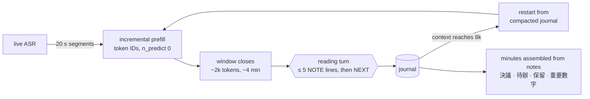

# meeting-summarizer

Minutes of a long meeting, written **live, on the phone**, while the meeting is going on.

The input is a zh-TW meeting of 1.5–4 h, transcribed by on-device ASR. The output is structured minutes. Every item cites the transcript line it rests on.

One small model does three jobs:
1. it **reads the meeting live** and writes typed, cited notes; the minutes are those notes grouped by type;
2. at stop, it **converts the notes into a prose summary** that keeps their citations;
3. it **titles the meeting** from the notes.

**Target device:** OPPO Reno7 (Dimensity 900, 8 GB). It runs **Gemma-4-E2B**, distilled from Qwen3.8-27B, on the CPU only. The current build, **mobile-v1**, runs on LiteRT-LM within a 3 GB RAM budget. Earlier versions (v3–v11) are llama.cpp Q4_0 GGUFs.

**Weights:** [Luigi/gemma-4-E2B-meeting-agent-zh-GGUF](https://huggingface.co/Luigi/gemma-4-E2B-meeting-agent-zh-GGUF) (`.litertlm` for LiteRT-LM, Q4_0 GGUFs, LoRA adapters, system prompt). **Integrating into an app:** [docs/voxsumdroid-integration.md](docs/voxsumdroid-integration.md) (ASR, diarization and summarization in parallel).

## Results

On 38 held-out IVOD sessions, judged by Gemma-4-31B against the transcript (`eval/judge_prose_tx.py`: each cited statement is checked from 30 s before its citation to 150 s after):

| | Gemma-4-E2B (v3) | Qwen3.8-27B (reference, 10 sessions) |
|---|---|---|
| minutes contradicted by the transcript | 18 % | 11 % |
| notes contradicted | 15 % | 10 % |
| coverage of the gold's key points | **0.92** | 0.88 |
| gold decisions recalled | **83 %** | 73 % |

The deployed configuration restarts from the compacted journal at 8k tokens, as on the phone. Against a 32k budget it loses nothing: 18 % contradicted in both cases, coverage 0.92 against 0.91, and decisions recalled 83 % against 77 %. The compacted journal puts decisions, open issues and actions back at the head of the context at each restart.

**Live on a Reno7.** A 2 h 08 meeting was replayed at real speed:

| | |
|---|---|
| lag after each ~4 min window | **67 s median, 115 s max**, no drift |
| notes written | 80 |
| effective speed | prefill 16 tok/s, decode 4.5 tok/s |
| battery temperature | 30 → 37 °C over 2 h 10 |

## mobile-v1 (latest): LiteRT-LM, on the phone's CPU, within 3 GB

mobile-v1 runs the reader on [LiteRT-LM](https://github.com/google-ai-edge/LiteRT-LM), inside Google's own Gemma-4-E2B **mobile** graph: int2 MLP in layers 15–34, int4 elsewhere, an int8 KV cache and int8 static-range activations. It is built in three steps:
1. **Fine-tune on Google's mobile weights.** A LoRA trained on those weights distils v11: v11's top-32 next-token distributions plus the gold (`distill/kd_teacher_logits.py`, `distill/sft_mobile_qat.py --kd`).
2. **GPTQ onto Google's grid**, with Google's scales held fixed (`distill/gptq_mobile.py`). Rounding to the nearest integer would erase the fine-tune; GPTQ keeps it (validation loss 0.83 against 1.17).
3. **Injection** of the integers into Google's `.litertlm`, bit for bit, with fp32 GPU activations and the memory-hungry `prefill_1024` signature disabled (`distill/inject_litertlm.py`).

| Reno7, 4k context | llama.cpp v11 (8k) | **mobile-v1, CPU** |
|---|---|---|
| prefill | 8 tok/s at depth | **118 tok/s** |
| decode | 4–7 tok/s | **~10 tok/s** |
| peak RSS | — | **2.28 GB** |
| minutes contradicted (IVOD 38) | 17 % | 17 % |
| 決議事項 really decided | 71 % | 75 % |

**Why 4k.** LiteRT-LM's XNNPACK backend allocates, per graph partition, a workspace of ctx² × 4 bytes × KV heads, so memory grows quadratically with the context. One session per window at 4k loses almost nothing in quality. Details and recommended settings: [integration note §12](docs/voxsumdroid-integration.md#12-litert-lm-the-mobile-model-recommended).

## v11: more precise decisions, better titles

v11 is v8 plus a contrastive DPO (`distill/build_contrast_pairs.py`, `distill/dpo_agent.py`). The 2,700 pairs come from the teacher's verified notes, each with one note altered in one of the students' three dominant error types (`eval/contradiction_types.py`): the right fact on the wrong object, the wrong body or role, an inverted result.

| IVOD, 38 held-out sessions | v5 | v8 | **v11** |
|---|---|---|---|
| minutes contradicted | 18 % | 17 % | 17 % |
| coverage | 0.92 | **0.94** | 0.89 |
| 決議事項 really decided | 61 % | 62 % | **71 %** |
| 待辦 really assigned | 64 % | **68 %** | 66 % |
| title (1–5) | 4.18 | 4.05 | **4.21** |
| prose: sentences contradicting the notes | 9 % | 8 % | 8 % |

v11 lists fewer decisions, and more of them were really decided. In exchange it covers less of the meeting. Faithfulness is unchanged: the synthetic pairs taught the model to file fewer decisions, not to bind facts better. Weights in `v11/` of the Hugging Face repo; v8 stays for the widest coverage.

**Where the remaining errors come from** (`eval/contradiction_types.py`, share of all minutes statements). Binding (the right fact attached to the wrong year, article or body): 4.8 % for v8, 13 % for Qwen3.5-0.8B, ~20 % for the 1B-class models, 2.4 % for the 27B teacher. Attribution and inverted results add 3–8 % each. The rate is flat across window position, note order and note type: it is per-fact comprehension, not a context or restart artifact. Shorter windows, a lexical grounding filter and a mechanical attribution guard did not move it.

**Smaller students** (same data and protocol, LoRA SFT; IVOD 38): Qwen3.5-0.8B 31 % minutes contradicted (30 % after GRPO), coverage 0.83–0.86; Qwen3-0.6B 39 %; LFM2.5-1.2B 47 %; Hunyuan-0.5B 49 %; MiniCPM5-1B 50 %; Gemma-3-1B 52 %; Granite-4.0-350M 59 %. Qwen3.5-0.8B prefills ~3× faster than Gemma-4-E2B on a Raspberry Pi 4 and does not slow down with context depth (linear attention).

## v8: reading, prose and title in one model

v8 is fine-tuned on all three jobs. The two conversion calls use VoxSumDroid's own prompts, byte for byte (`eval/conversion_prompts.py`). They are style conversions: the prose must say nothing the notes do not say.

- **Conversion SFT.** Qwen3.8-27B wrote a summary and a title for 543 training journals (`distill/convert_targets.py`). The judge checked each summary sentence against the notes (`eval/judge_prose_notes.py`). Only summaries with no contradicted sentence and the requested form were kept: 123 summaries and 540 titles (`distill/build_convert_sft.py`). They were added to the v5 reading data.
- **Multi-task GRPO** (`distill/grpo_multi.py`). 150 steps from that adapter, on 1,200 reading windows, 400 prose calls and 400 title calls. Qwen3.8-27B (NInfer) scores each sample (`distill/rl_rewards.py`):
  - reading: each note's faithfulness to the transcript, whether its DECISION / ACTION type holds, and recall of the teacher's notes, so writing less does not pay;
  - prose: each sentence's faithfulness to the notes, and form;
  - title: a 1–5 score.

  The KL is taken against the starting adapter. One GPU samples and trains, the other serves the judge.
- **A dead end.** A SFT variant (v7) that relabeled the teacher's note types and told the model to exclude the reading of minutes and rules gained a little precision, but lost coverage (0.92 → 0.88). RL kept the coverage and gained the precision.

| | v5 | **v8** | Qwen3.8-27B |
|---|---|---|---|
| **IVOD, 38 held-out sessions** | | | |
| coverage | 0.92 | **0.94** | |
| minutes contradicted | 18 % | **17 %** | |
| 決議事項 items really decided | 61 % | **62 %** | |
| 待辦 items really assigned | 64 % | **68 %** | |
| phone lag, worst case (model) | 24.9 min | **17.4 min** | |
| prose: sentences contradicting the notes | 9 % | **8 %** | 11 % |
| title (1–5) | 4.18 | 4.05 | 4.45 |
| **AliMeeting, 20 meetings (not in training)** | | | |
| coverage | 0.88 | 0.88 | |
| 決議事項 items really decided | 76 % | **79 %** | |
| 待辦 items really assigned | 66 % | **68 %** | |
| prose: sentences contradicting the notes | 19 % | **12 %** | 19 % |
| title (1–5) | 5.0 | 5.0 | 5.0 |

The prose of the 2B model is more faithful to the notes than its 27B teacher's, because it learned only from the teacher's faithful summaries. Titles are not yet better than v5's: the title reward barely varied within a sample group, so it gave the policy little signal. The weights are in `v8/` of the Hugging Face repo, with the same system prompt as v5.

## v5


On AliMeeting business meetings, v3 filed proposals as decisions and listed every idea discussed as an action. v5 (`--harness v5`):
- adds a `PROPOSAL` type, filed under a 討論要點 section;
- makes `DECISION` (announced) and `ACTION` (assigned, or with a deadline) strict;
- reclassifies a decision or action worded as a proposal;
- was retrained on 163 IVOD sessions plus 217 AliMeeting meetings.

The weights are in `v5/` of the Hugging Face repo; v3 stays at the root. New measure: `eval/section_precision.py` asks the judge whether each 決議事項 item was really decided and each 待辦 item really assigned.

| | v3 | **v5** |
|---|---|---|
| **AliMeeting, 20 meetings (not in training)** | | |
| minutes contradicted | 16 % | 16 % |
| notes contradicted | 17 % | **14 %** |
| coverage | 0.86 | **0.88** |
| 決議事項 items really decided | 58 % (276 items) | **76 %** (117) |
| 待辦 items really assigned | 40 % (355 items) | **66 %** (138) |
| **IVOD, 38 held-out sessions** | | |
| minutes contradicted | 18 % | 18 % |
| coverage | 0.92 | 0.92 |
| 決議事項 items really decided | 51 % (904 items) | **61 %** (682) |
| 待辦 items really assigned | 53 % (1,097 items) | **64 %** (517) |
| gold decisions recalled (keyword-matched) | 83 % | 78 % |
| notes per session | 89 | 104 |
| phone lag, median / p90 / max | 2.8 / 4.9 / 17.6 min | 2.8 / 5.9 / 24.9 min |

With only the v5 prompt, the v3 weights reach the same precision on AliMeeting (79 % and 64 %) but lose coverage (0.79). Retraining keeps both. The rise in lag comes from v5 writing more notes on dense parliament sessions.

## How the agent reads



- **One growing conversation.** The session is `[system] [journal] ([window k] [notes])*`. It only grows, so llama.cpp reuses its whole cache: each window costs only its own tokens.
- **Incremental prefill.** Each 20 s ASR segment is appended as token IDs (`/completion`, `n_predict: 0`) while people talk. When the window closes, only the notes remain to generate. The driver renders the chat template once and owns the token sequence, so every request extends the cached one exactly.
- **Short context on the phone.** Prefill on this CPU slows down with context depth:

  | context in cache | 0 | 4k | 8k | 16k |
  |---|---|---|---|---|
  | prefill of a 128-token chunk (tok/s) | 34.9 | 12.2 | 7.9 | 4.6 |

  At 8k the conversation restarts from a journal compacted to about 2.5k tokens (decisions, open issues and actions first, then recent notes). The restart is prefilled while the meeting goes on.
- **The model does not write the minutes.** Small models merge and invent at a reduce step. The minutes are the notes, grouped by type (`DECISION`, `ACTION`, `OPEN-ISSUE`, `NUMBER`).
- **Prompt rules that matter for a 2B:**
  - at most 5 notes per window, each of at most 40 characters;
  - no ASR speaker labels ("S3 認為…"), which are unreliable: such notes were contradicted at 27 %, against 17 % for the others;
  - no body or person that the excerpt does not name.
- **Guards:** at most 6 notes are parsed per turn, the output is capped at 400 tokens, near-duplicate notes are rejected, and every citation must resolve to a transcript line.

## How it was built

1. **Choosing the student.** Six ~2B Q4_0 models ran the same agent on the same sessions, under the same judge. Gemma-4-E2B was the only one to cover the meeting: coverage 0.77, against ≤ 0.33 for Qwen3.5-2B, MiniCPM5-2B, LFM2.5 and Apodex-2B. It was also the most faithful.
2. **Tuning the harness, with no fine-tuning.** Eight training sessions served as a dev set. Removing speaker labels, dropping the self-check turn (it never corrected anything) and adding a key-figures section took coverage from 0.77 to 0.93 and brought the phone lag to real time.
3. **Distillation.**
   - Qwen3.8-27B (NInfer, NVFP4) ran the tuned protocol on 163 training sessions.
   - The judge checked all 7,873 of its notes; turns with a contradicted note were kept as context but carry no loss.
   - A LoRA (r = 16) was trained on the QAT weights over the replayed conversations, then merged and requantized to Q4_0.
   - Result: gold decisions recalled rose from 72 % to 77 %.
4. **What did not help.** On 38 sessions, neither of these moved faithfulness beyond noise (about ±2 points):
   - on-policy DPO, where the 27B corrected 1,667 of the student's wrong windows;
   - a mechanical check of the numbers in notes against the transcript;
   - self-consistency: two samples per window, keeping only the notes both wrote. Samples rarely agree word for word, so coverage fell from 0.88 to 0.50, and the agreed notes were no more faithful (19 % contradicted in both cases).

   The remaining errors are mostly relational: the right figure attached to the wrong year, scope or body.

## Run

On the phone, with the upstream llama.cpp Android build:

```bash
llama-server -m gemma-4-E2B-meeting-agent-zh-v8-Q4_0.gguf -t 8 -c 32768 -np 1 --jinja --port 8200
python3 eval/phone_live.py --url http://127.0.0.1:8200 --session <id> --speed 1 --ctx 8192 --out runs/phone
```

On a GPU host, for evaluation (the same protocol through the chat API):

```bash
llama-server -m gemma-4-E2B-meeting-agent-zh-v8-Q4_0.gguf -ngl 99 -c 131072 -np 4 --jinja --swa-full --port 8140 --alias rt
python3 eval/realtime_agent.py --url http://127.0.0.1:8140/v1 --model rt --parallel 4 \
  --harness v5 --no-check --overview none --number-section \
  --read-max-tokens 400 --restart-journal-tokens 2500 --ctx 8192 --out runs/student/<name>
PREFIX=h38 SPLIT=data/split_rt_heldout38.json bash scripts/rt_dev.sh <tag> <agent options>   # generate + judge
```

Building the model:

```bash
bash scripts/rt_teacher_traces.sh                   # 27B traces on training sessions, judged
python3 distill/build_agent_sft.py                  # replay into SFT conversations
python3 distill/sft_agent.py --out runs/sft/agent/lora
python3 distill/merge_agent_lora.py --adapter runs/sft/agent/lora/epoch0 --out ft-ep0f16-q4_0.gguf
```

v6–v8 (conversion SFT, then multi-task GRPO; two GPUs):

```bash
python3 distill/convert_targets.py --journals runs/teacher/... --out runs/convert/teacher-train   # 27B summaries and titles
python3 distill/build_convert_sft.py --targets runs/convert/teacher-train --judged <judge_prose_notes report> --out data/train/convert_rows.jsonl
python3 -m torch.distributed.run --nproc_per_node 2 distill/sft_agent.py --rows <reading + conversion rows> --out runs/sft/agent/lora-v6
python3 distill/rl_prompts.py                       # prompt pool: reading windows, prose and title calls
bash scripts/v8_grpo.sh                             # GRPO (judge on GPU 1), merge, evaluation of the three tasks
```

The merge converts through f16, not bf16: the one tensor that stays unquantized (`per_layer_model_proj`) must be F16, as in Google's QAT GGUF. The phone CPU has no bf16, which cost 13 % of prefill speed.

## Layout

| path | contents |
|---|---|
| `eval/realtime_agent.py` | the reading agent (chat API; harness variants v0–v7, v5 deployed) |
| `eval/phone_live.py` | live phone driver: real-speed replay, token-ID incremental prefill, measured lag |
| `eval/judge_prose_tx.py`, `eval/judge_prose.py`, `eval/minutes_report.py`, `eval/rt_report.py` | transcript-grounded judge, coverage, per-section report, phone timing model |
| `scripts/rt_dev.sh` | one generate-and-judge iteration (dev or held-out) |
| `distill/build_agent_sft.py`, `distill/sft_agent.py`, `distill/merge_agent_lora.py` | distillation: data, LoRA training, merge → Q4_0 |
| `eval/conversion_prompts.py`, `eval/judge_prose_notes.py`, `eval/title_eval.py`, `eval/section_precision.py` | VoxSumDroid's title and prose prompts; prose fidelity to the notes; title score; are decisions decided and actions assigned |
| `distill/convert_targets.py`, `distill/build_convert_sft.py`, `distill/relabel_types.py` | teacher summaries and titles, filtered; type relabeling (v7, not kept) |
| `distill/rl_prompts.py`, `distill/rl_rewards.py`, `distill/grpo_multi.py` | multi-task GRPO: prompt pool, judge rewards, trainer |
| `distill/correct_onpolicy.py`, `distill/dpo_agent.py` | on-policy corrections and DPO (neutral, kept for reference) |
| `eval/incremental_prefill_test.py`, `eval/number_check.py` | per-model incremental-prefill check; number check (no gain) |
| `summarizer/` | transcript ingest, windowing, citation resolution |

Data (transcripts, gold minutes, runs) is not included. The weights are on Hugging Face (link above).

## Next

- **Titles on parliament meetings:** a pairwise reward against the teacher's title, which varies more within a group than a 1–5 score.
- **Quantization loss:** the same merged model in f16 and in Q4_0 on the three tasks (`scripts/quant_check.sh`). If the gap is large, train the LoRA quantization-aware.

- **Faithfulness:** a larger student that still keeps pace on the phone (Gemma-4-E4B, not yet measured), or human review of decisions and key figures.
- **On the device:**
  - repack on or off on a `dotprod` CPU. A Raspberry Pi 4 (A72, 4 GB) cannot tell: it has no `dotprod`, so llama.cpp never repacks Q4_0 there. It does show that the model runs on 4 GB, in mmap under a memory cap, with about 2–2.8 GB resident (nearly all file-backed pages), at prefill 5 tok/s and decode 2.2 tok/s;
  - ASR on the same CPU;
  - judged quality of the notes produced on the phone;
  - prefill of the restart context on a second slot;
  - the Kotlin port.
