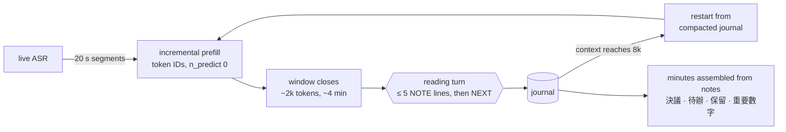

# meeting-summarizer

Minutes of a long meeting, written **live, on the phone**, while the meeting is going on.

The input is a zh-TW meeting of 1.5–4 h, transcribed by on-device ASR. The output is structured minutes. Every item cites the transcript line it rests on.

**Target device:** OPPO Reno7 (Dimensity 900, 8 GB). It runs **Gemma-4-E2B (QAT, Q4_0)**, distilled from Qwen3.8-27B, on llama.cpp, CPU only.

**Weights:** [Luigi/gemma-4-E2B-meeting-agent-zh-GGUF](https://huggingface.co/Luigi/gemma-4-E2B-meeting-agent-zh-GGUF) (Q4_0 GGUF, LoRA adapter, system prompt). **Integrating into an app:** [docs/voxsumdroid-integration.md](docs/voxsumdroid-integration.md) (ASR, diarization and summarization in parallel).

## Results

On 38 held-out IVOD sessions, judged by Gemma-4-31B against the transcript (`eval/judge_prose_tx.py`: each cited statement is checked from 30 s before its citation to 150 s after):

| | Gemma-4-E2B, deployed | Qwen3.8-27B (reference, 10 sessions) |
|---|---|---|
| minutes contradicted by the transcript | 18 % | 11 % |
| notes contradicted | 15 % | 10 % |
| coverage of the gold's key points | **0.91** | 0.88 |
| gold decisions recalled | **77 %** | 73 % |

**Live on a Reno7.** A 2 h 08 meeting was replayed at real speed:

| | |
|---|---|
| lag after each ~4 min window | **67 s median, 115 s max**, no drift |
| notes written | 80 |
| effective speed | prefill 16 tok/s, decode 4.5 tok/s |
| battery temperature | 30 → 37 °C over 2 h 10 |

## How the agent reads



- **One growing conversation.** The session is `[system] [journal] ([window k] [notes])*`. It only grows, so llama.cpp reuses its whole cache: each window costs only its own tokens.
- **Incremental prefill.** Each 20 s ASR segment is appended as token IDs (`/completion`, `n_predict: 0`) while people talk. When the window closes, only the notes remain to generate. The driver renders the chat template once and owns the token sequence, so every request extends the cached one exactly.
- **Short context on the phone.** Prefill on this CPU slows down with context depth:

  | context in cache | 0 | 4k | 8k | 16k |
  |---|---|---|---|---|
  | prefill of a 128-token chunk (tok/s) | 34.9 | 12.2 | 7.9 | 4.6 |

  At 8k the conversation restarts from a journal compacted to about 2.5k tokens (decisions, open issues and actions first, then recent notes). The restart is prefilled while the meeting goes on.
- **The model does not write the minutes.** Small models merge and invent at a reduce step. The minutes are the notes, grouped by type (`DECISION`, `ACTION`, `OPEN-ISSUE`, `NUMBER`).
- **Prompt rules that matter for a 2B:**
  - at most 5 notes per window, each of at most 40 characters;
  - no ASR speaker labels ("S3 認為…"), which are unreliable: such notes were contradicted at 27 %, against 17 % for the others;
  - no body or person that the excerpt does not name.
- **Guards:** at most 6 notes are parsed per turn, the output is capped at 400 tokens, near-duplicate notes are rejected, and every citation must resolve to a transcript line.

## How it was built

1. **Choosing the student.** Six ~2B Q4_0 models ran the same agent on the same sessions, under the same judge. Gemma-4-E2B was the only one to cover the meeting: coverage 0.77, against ≤ 0.33 for Qwen3.5-2B, MiniCPM5-2B, LFM2.5 and Apodex-2B. It was also the most faithful.
2. **Tuning the harness, with no fine-tuning.** Eight training sessions served as a dev set. Removing speaker labels, dropping the self-check turn (it never corrected anything) and adding a key-figures section took coverage from 0.77 to 0.93 and brought the phone lag to real time.
3. **Distillation.**
   - Qwen3.8-27B (NInfer, NVFP4) ran the tuned protocol on 163 training sessions.
   - The judge checked all 7,873 of its notes; turns with a contradicted note were kept as context but carry no loss.
   - A LoRA (r = 16) was trained on the QAT weights over the replayed conversations, then merged and requantized to Q4_0.
   - Result: gold decisions recalled rose from 72 % to 77 %.
4. **What did not help.** On 38 sessions, neither of these moved faithfulness beyond noise (about ±2 points):
   - on-policy DPO, where the 27B corrected 1,667 of the student's wrong windows;
   - a mechanical check of the numbers in notes against the transcript.

   The remaining errors are mostly relational: the right figure attached to the wrong year, scope or body.

## Run

On the phone, with the upstream llama.cpp Android build:

```bash
llama-server -m ft-ep0f16-q4_0.gguf -t 8 -c 32768 -np 1 --jinja --port 8200
python3 eval/phone_live.py --url http://127.0.0.1:8200 --session <id> --speed 1 --ctx 8192 --out runs/phone
```

On a GPU host, for evaluation (the same protocol through the chat API):

```bash
llama-server -m ft-ep0f16-q4_0.gguf -ngl 99 -c 131072 -np 4 --jinja --swa-full --port 8140 --alias rt
python3 eval/realtime_agent.py --url http://127.0.0.1:8140/v1 --model rt --parallel 4 \
  --harness v3 --no-check --overview none --number-section \
  --read-max-tokens 400 --restart-journal-tokens 2500 --out runs/student/<name>
PREFIX=h38 SPLIT=data/split_rt_heldout38.json bash scripts/rt_dev.sh <tag> <agent options>   # generate + judge
```

Building the model:

```bash
bash scripts/rt_teacher_traces.sh                   # 27B traces on training sessions, judged
python3 distill/build_agent_sft.py                  # replay into SFT conversations
python3 distill/sft_agent.py --out runs/sft/agent/lora
python3 distill/merge_agent_lora.py --adapter runs/sft/agent/lora/epoch0 --out ft-ep0f16-q4_0.gguf
```

The merge converts through f16, not bf16: the one tensor that stays unquantized (`per_layer_model_proj`) must be F16, as in Google's QAT GGUF. The phone CPU has no bf16, which cost 13 % of prefill speed.

## Layout

| path | contents |
|---|---|
| `eval/realtime_agent.py` | the reading agent (chat API; harness variants v0–v4) |
| `eval/phone_live.py` | live phone driver: real-speed replay, token-ID incremental prefill, measured lag |
| `eval/judge_prose_tx.py`, `eval/judge_prose.py`, `eval/minutes_report.py`, `eval/rt_report.py` | transcript-grounded judge, coverage, per-section report, phone timing model |
| `scripts/rt_dev.sh` | one generate-and-judge iteration (dev or held-out) |
| `distill/build_agent_sft.py`, `distill/sft_agent.py`, `distill/merge_agent_lora.py` | distillation: data, LoRA training, merge → Q4_0 |
| `distill/correct_onpolicy.py`, `distill/dpo_agent.py` | on-policy corrections and DPO (neutral, kept for reference) |
| `eval/incremental_prefill_test.py`, `eval/number_check.py` | per-model incremental-prefill check; number check (no gain) |
| `summarizer/` | transcript ingest, windowing, citation resolution |

Data (transcripts, gold minutes, runs) is not included. The weights are on Hugging Face (link above).

## Next

- **Faithfulness:** a larger student that still keeps pace on the phone (Gemma-4-E4B, not yet measured), or human review of decisions and key figures.
- **On the device:**
  - ASR on the same CPU;
  - judged quality of the notes produced on the phone;
  - prefill of the restart context on a second slot;
  - the Kotlin port.
