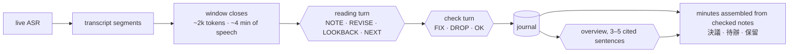
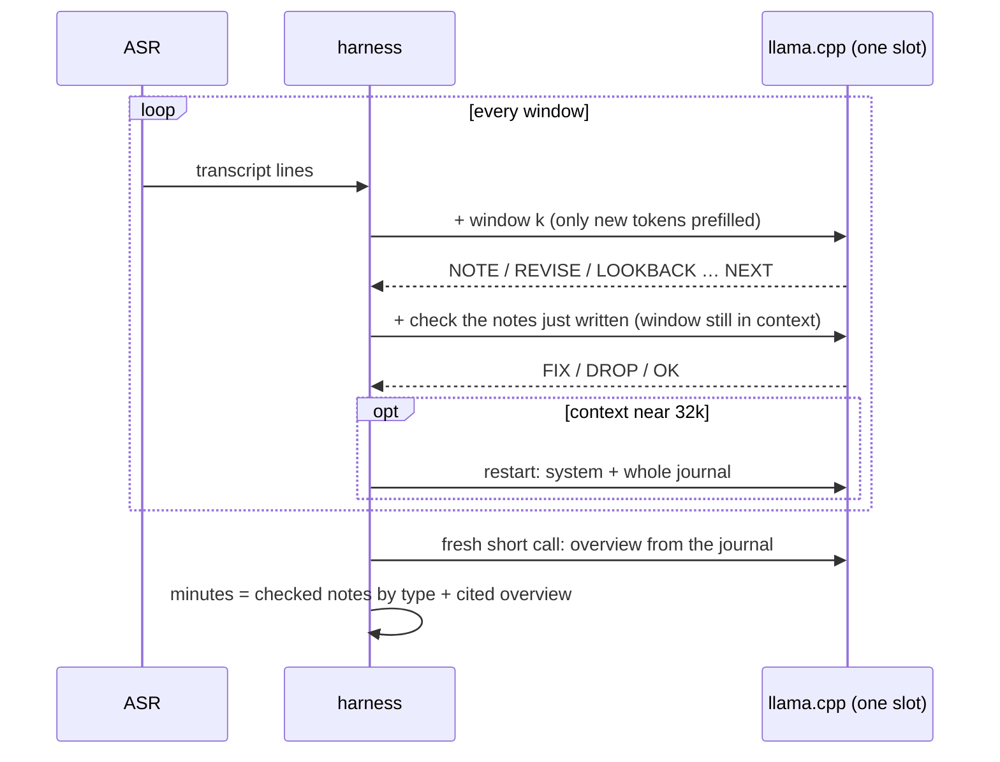

# meeting-summarizer

Minutes of a long meeting, written **live, on the phone**, while the meeting is going on.

The input is a zh-TW meeting of 1.5–3.5 h, transcribed by on-device ASR. The output is structured minutes. Every item cites the transcript line it rests on.

**Target device:** OPPO Reno7 (Dimensity 900, 8 GB), with CPU-only llama.cpp. Every model call fits a context of ≤ 32k tokens, and the agent must keep pace with the meeting as it happens.

## Architecture

A **realtime reading agent** runs on the phone with **Gemma-4-E2B (QAT, Q4_0)**, the student chosen by the bake-off below. The agent protocol is designed and validated with **Qwen3.8-27B**, which serves as the quality reference and, later, as the teacher. Every candidate runs the *same* protocol, so the 27B's traces can be used directly for fine-tuning.



### One growing conversation per session

On a phone CPU, prefill dominates the cost (≈35–40 tok/s against 7–9 tok/s of decode for a 2B). The design therefore never recomputes what it has already read.

The candidate models are hybrids: Qwen3.5 has Gated-DeltaNet layers and LFM2.5 has short-convolution layers, so part of their state is recurrent. llama.cpp can reuse the cache for them only when the new prompt **extends** the previous one. A prompt that diverges after a shared prefix is recomputed from the divergence.

For this reason a session is a single conversation that only grows:

```
[system] [journal so far] ([window k] [actions] [check] [fixes])*
```

- Each window costs only its own tokens, plus a short check turn.
- A reading turn stops at `NEXT`. The stop word is kept in the history, so that the history matches exactly what was generated.
- When the next window would overflow 32k, the conversation restarts from `[system] [whole journal]`, one or two times in a 3.5 h meeting.
- Models that always think (LFM2.5-2.6B) get an empty `<think></think>` prefilled. The block is kept in the history (`preserve_thinking`), which keeps the cache valid. The agent detects these models by itself.



### Why the model does not write the minutes

Earlier distillation work showed that a small model merges items and invents facts at the reduce step: reducing doubled the error rate. Here the minutes are **assembled** from the checked notes, grouped by type (`DECISION` → 決議, `ACTION` → 待辦, `OPEN-ISSUE` → 保留). The model only writes a short overview, and every overview sentence must cite a time that exists in the journal.

The harness also guards against a small model's loops:
- at most 8 notes or revisions per turn;
- a note or revision that repeats an existing note is rejected (bigram Jaccard > 0.6);
- a citation must resolve to a transcript line.

### Incremental (chunked) prefill

Prefilling a window only when it closes leaves the CPU idle while people talk. With incremental prefill, each ASR segment is prefilled as soon as it arrives:
- the harness renders the chat template around a placeholder (`/apply-template`);
- it appends each segment as token IDs through `/completion`, with `n_predict: 0`;
- it keeps the user turn open until the window closes.

When the window closes, only the check and the decode remain. The same tokens are computed, so no output changes; prefill simply moves into the wait. Managing the token sequence directly also avoids chat templates that re-render the history differently from what was generated. That problem is why MiniCPM5 and LFM2.5 lost their cache in chat mode.

`eval/incremental_prefill_test.py` checks this on every candidate (upstream llama.cpp). The window is about 3.5k tokens fed as 15 chunks. It is compared against a one-shot prefill of the same tokens.

| model | recomputed / new tokens | turn close | KL, first token | same first token |
|---|---|---|---|---|
| Gemma-4-E2B | 3530 / 3520 | 5 / 5 | 0.022 | ✅ |
| Gemma-4-E2B `--swa-full` | 3520 / 3520 | 5 / 5 | 0.017 | ✅ |
| Qwen3.5-2B | 3447 / 3447 | 9 / 9 | 0.004 (CPU 0.001) | ✅ |
| MiniCPM5-2B | 3488 / 3488 | 9 / 9 | 0.001 (CPU 0.0005) | ✅ |
| LFM2.5-2.6B | 3471 / 3471 | 6 / 6 | 0.023 (CPU 0.001) | ✅ |
| LFM2.5-1.2B | 4174 / 4174 | 5 / 5 | 0.001 | ✅ |
| LFM2.5-8B-A1B | 3471 / 3471 | 5 / 5 | 0.000 | ✅ |

- Greedy outputs can drift after 20–80 tokens. This is float rounding between the kernel paths for small and large batches, amplified by near-ties between tokens; it is smaller on CPU.
- Gemma's sliding-window attention recomputes a few tokens; `--swa-full` makes the reuse exact.

On the Reno7, prefill speed barely depends on chunk size:

| chunk (tokens) | 32 | 64 | 128 | 256 | 512 |
|---|---|---|---|---|---|
| Qwen3.5-2B Q4_0 prefill (tok/s) | 36.9 | 35.7 | 38.7 | 39.8 | 39.7 |

## Results so far

The protocol was validated with **Qwen3.8-27B** (NVFP4, served by NInfer on one RTX 5090) on 10 held-out IVOD sessions. The judge is Gemma-4-31B: `eval/judge_prose_tx.py` checks each cited statement against the transcript, from 30 s before its citation to 150 s after.

| | Qwen3.8-27B, realtime agent | gold (teacher) |
|---|---|---|
| notes contradicted (25 sampled per session) | 10 % | 7 % |
| notes unsupported | 24 % | 8 % |
| **minutes contradicted** | **11 %** | 17 % (gold prose) |
| coverage of the gold's key points | 0.88 | 0.90 |
| recall of gold decisions | 73 % | — |
| well-formed action lines | 100 % | — |

Per section of the minutes:

| section | contradicted | unsupported |
|---|---|---|
| decisions | 10 % | 22 % |
| actions | 9 % | 29 % |
| held / open | 11 % | 30 % |
| overview | 18 % | 55 % |

Two known weaknesses:
- The model attributes statements to bodies the excerpt does not name, for example "財政部說明…" when the speaker labels only say S1.
- The overview synthesizes passages far from its citations.

### Bake-off: which ~2B Q4_0 drives the agent

The candidates run the same agent on the same 10 held-out sessions and face the same judge. The phone lag is modelled from each run's token counts and the model's measured Reno7 speed.

| model | notes contradicted | notes unsupported | minutes contradicted | coverage | gold decisions recalled | well-formed actions | max phone lag |
|---|---|---|---|---|---|---|---|
| *Qwen3.8-27B (reference)* | *10 %* | *24 %* | *11 %* | *0.88* | *73 %* | 100 % | 2.6 min |
| **Gemma-4-E2B QAT Q4_0** | **17 %** | **9 %** | **21 %** | **0.77** | **57 %** | 100 % | 15.6 min |
| MiniCPM5-2B | 22 % | 9 % | 21 % | 0.33 | 0 % | 100 % | 220 min † |
| Qwen3.5-2B | 22 % | 36 % | 28 % | 0.29 | 16 % | 100 % | 5.6 min |
| LFM2.5-2.6B | 24 % | 10 % | 28 % | 0.12 | 7 % | 83 % | 122 min † |
| LFM2.5-8B-A1B | 15 % | 29 % | 35 % | 0.07 | 16 % | 52 % | 30 min |
| LFM2.5-1.2B | 59 % | 32 % | — | 0.00 | 0 % | 44 % | 2.5 min |

† No cache reuse in chat mode: the chat template re-renders earlier turns differently. The token-level harness removes this (see incremental prefill).

**Gemma-4-E2B is locked as the student.** It is the only ~2B model that covers the meeting (0.77 against ≤ 0.33 for the others), and it is also the most faithful.

Its weakness is volume: 121 notes per session against 64 for the 27B. The decoding of all those notes is what puts it 15 min behind on the phone.

### Harness tuning for Gemma-4-E2B, with no fine-tuning

The harness was iterated on a **dev set of 8 training sessions** (`data/split_rt_dev.json`, loop `scripts/rt_dev.sh`). Only the chosen configurations were then measured on the 10 held-out sessions.

| dev variant | minutes contradicted | coverage | gold decisions | phone lag |
|---|---|---|---|---|
| v0 (bake-off protocol) | 20 % | 0.81 | 53 % | 9.5 min |
| v1: 3 notes/window, verbatim quote required and checked | 13 % | 0.35 | 44 % | 7.3 min |
| v2: 5 notes, quote checked only when given | 14 % | 0.71 | 54 % | 11.6 min |
| v2n: v2 + key-figures section | 14 % | 0.79 | 54 % | 11.6 min |
| v3: v2 rules without quotes | 17 % | 0.81 | 68 % | 8.9 min |
| **v3x: v3 + key figures, no overview** | 17 % | **0.92** | **68 %** | 8.9 min |
| v4x: v3x + quotes on DECISION/NUMBER only | 15 % | 0.83 | 68 % | 9.4 min |

What each change taught:
- **Speaker labels are the biggest error source.** Notes that name an ASR speaker label ("S3 認為…") were contradicted at 27 %, against 17 % for the others, because the labels are unreliable. The tuned prompt forbids them, along with any body or person the excerpt does not name.
- **The check turn never corrected anything.** Across the 8 dev sessions it produced 0 FIX and 0 DROP, so it is dropped.
- **A verbatim quote checked by the harness** lowers contradictions, but a small model then writes too little: coverage and decision recall fall. It is kept only as an option.
- **A key-figures section** (the `NUMBER` notes) brings most of the coverage gain. The overview, which was the least supported section, is dropped.

Held-out result (10 sessions, same judge as the bake-off). v3x is `--harness v3 --no-check --overview none --number-section`.

| | Gemma-4-E2B, bake-off harness | **Gemma-4-E2B, tuned harness (v3x)** | Qwen3.8-27B |
|---|---|---|---|
| minutes contradicted | 21 % | **18 %** | 11 % |
| minutes unsupported | 9 % | 9 % | 30 % |
| notes contradicted | 17 % | 19 % | 10 % |
| coverage | 0.77 | **0.91** | 0.88 † |
| gold decisions recalled | 57 % | 59 % | 73 % |
| **max phone lag** | 15.6 min | **3.4 min** (2.4 with incremental prefill) | — |
| minutes ready after the end | 19.9 min | **2.8 min** | — |

† The 27B minutes had no key-figures section.

With zero fine-tuning, the tuned harness makes Gemma-4-E2B keep pace with the meeting on the phone and cover the meeting as well as the 27B. Faithfulness is still short of the 27B: 18 % of minutes contradicted, against 11 %. The weakest section is the key figures, at 25 % contradicted (wrong amounts and article numbers). This gap is the target of the fine-tuning.

### Phone budget

A 3.5 h meeting needs about **55k tokens of prefill** in total, restarts included. The previous stateless agent needed about 180k.

The 27B's token volume was replayed at the measured speed of a 2B on the Reno7:
- with prefill at window close, the agent falls at most 1.2–2.6 min behind the meeting, and the minutes are ready 1.3–3.6 min after it ends;
- with incremental prefill, the modelled delays are 0.4–1.7 min behind and 0.8–3.0 min after the end.

Reno7 CPU speeds (8 threads, `llama-bench` pp512 / tg32, tok/s):

| model | prefill | decode |
|---|---|---|
| LFM2.5-1.2B Q4_0 | 78.1 | 18.2 |
| Qwen3.5-2B Q4_0 | 40.4 | 8.8 |
| LFM2.5-2.6B Q4_0 | 35.0 | 8.0 |
| Gemma-4-E2B Q4_0 (QAT) | 34.6 | 7.0 |
| MiniCPM5-2B Q4_0 | 33.5 | 9.2 |
| LFM2.5-8B-A1B Q4_0 (MoE) | 24.5 | 9.0 |
| Qwen3.5-4B Q4_0 | 15.4 | 4.2 |

Q4_0 beats Q4_K_M (−15 to −23 % prefill) and Q8_0 on this CPU. A 27B, even ternary (Bonsai), is out of reach on this phone: at best 2.6 tok/s of prefill.

## Plan

1. **Teacher traces** (running). Qwen3.8-27B (NInfer) runs the tuned protocol on the training sessions, excluding the held-out and dev sessions. Its notes are then checked against the transcript by the judge, and turns with contradicted notes are filtered out.
2. **Fine-tuning.** LoRA on the Gemma-4-E2B QAT weights over the filtered traces, then requantize to Q4_0. It is evaluated on the same held-out sessions.
3. **On the device.** Run the token-level harness with incremental prefill on the Reno7, using the upstream llama.cpp Android build, with the ASR running alongside and a hot, throttled CPU.

## Run

```bash
# teacher / reference (any OpenAI-compatible server; llama-server reports cache use in `timings`)
python3 eval/realtime_agent.py --url http://127.0.0.1:8120/v1 --model q38 \
  --split data/split_rt_bakeoff.json --out runs/student/rt-q38-27b

# a ~2B candidate on llama.cpp (upstream): -np 4 slots of 32k
llama-server -m Qwen3.5-2B-Q4_0.gguf -ngl 99 -c 131072 -np 4 --jinja --port 8110 --alias rt
python3 eval/realtime_agent.py --url http://127.0.0.1:8110/v1 --model rt --parallel 4 \
  --phone-pp 40.4 --phone-tg 8.8 --out runs/student/rt-q35-2b

bash scripts/rt_bakeoff2.sh                 # all candidates, two at a time
bash scripts/rt_judge_one.sh q38-27b q35-2b  # judge notes + minutes, coverage, per-section report
python3 eval/rt_report.py                   # one table: faithfulness, coverage, protocol, phone lag
```

Each session record stores the notes, the minutes and a trace of every call. Each trace entry holds its arrival time and the tokens prefilled and decoded, so the phone timing can be recomputed for any measured speed.

## Layout

| path | contents |
|---|---|
| `eval/realtime_agent.py` | the realtime reading agent |
| `eval/rt_report.py`, `eval/minutes_report.py` | bake-off table, per-section report, phone timing model |
| `eval/judge_prose_tx.py`, `scripts/v2_judge.sh` | transcript-grounded judge |
| `scripts/rt_bakeoff2.sh`, `scripts/rt_judge_one.sh` | bake-off and judging runners |
| `scripts/rt_dev.sh` | one harness-tuning iteration on the dev split (or, with `PREFIX=rt SPLIT=…`, on held-out) |
| `eval/incremental_prefill_test.py` | per-model check of incremental prefill (cache reuse, output agreement) |
| `eval/journal_agent.py` | earlier stateless journal agent (full re-prefill per turn) |
| `summarizer/` | transcript ingest, windowing, citation resolution |
| `distill/`, other `eval/` | earlier map-reduce distillation and evaluation work |

Data (transcripts, gold minutes, runs) is not included.

## Status

Research, not production. Still to do: the fine-tuning, incremental prefill on the device, human evaluation, and the Kotlin port.
