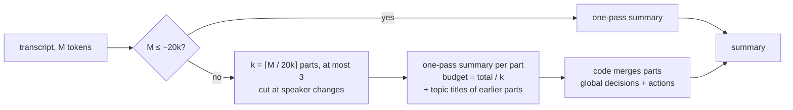
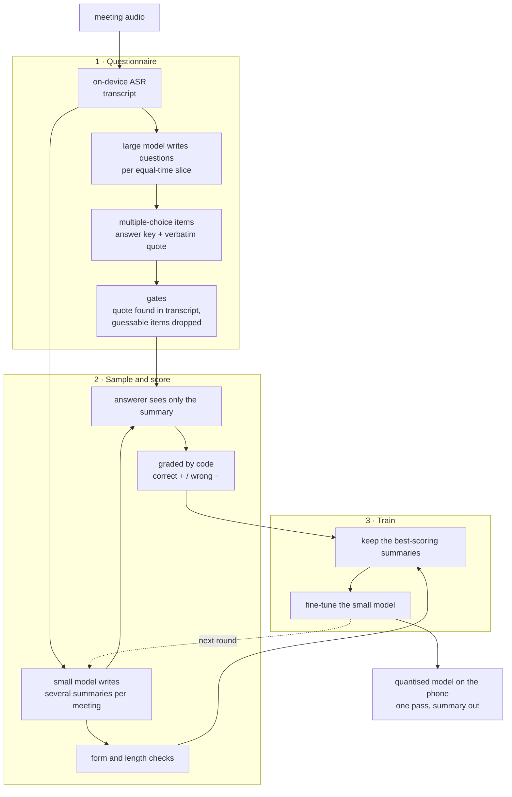

# Meeting Summarizer v4.5

Reliable minutes for long meetings, produced **on the phone** by a small model in one pass per part.

The input is a 1.5–3 h zh-TW meeting (mixed with English) transcribed by on-device ASR. The output is a **multi-part summary**: the meeting is cut into a few parts, each part gets a short summary under a topic title, and decisions and actions are gathered at the end. Every statement cites the transcript time it rests on.

**Status, 2026-11-13: v4.5 is the new direction; the multi-part test has not run yet. Nothing from v4 or v4.5 is released.**

**Why v4.5.** v4 asked one sub-4B model to summarise a whole 2–3 h transcript at once. It works but fails in two ways ([issue #1](https://github.com/vieenrose/meeting-summarizer/issues/1)): small models favour the start of long input (position bias: 65 % of citations in the first third), and a 60k-token prefill takes about 90 min on the phone. Cutting the meeting into parts keeps each input in the range where small models read evenly, and gives the reader a structure by topic.

**Design.**

```mermaid
flowchart LR
    A[transcript, M tokens] --> B{M ≤ ~20k?}
    B -- yes --> C[one-pass summary]
    B -- no --> D[k = ⌈M / 20k⌉ parts, at most 3<br/>cut at speaker changes]
    D --> E[one-pass summary per part<br/>budget = total / k<br/>+ topic titles of earlier parts]
    E --> F[code merges parts<br/>global decisions + actions]
    C --> G[summary]
    F --> G
```

- **Model:** sub-4B LLM on the phone, CPU only. Current student: Bolt 4GB on a Galaxy Note10+; Gemma-4-E2B for the Galaxy A53.
- **Part size N ≈ 20k tokens** balances phone cost and content. Measured on the Note10+ (Bolt, CPU): prefill 34 tok/s at 16k vs 10.7 tok/s at 60k; peak memory 2.75 GB at 16k vs 3.19 GB at 60k.
- **Fixed total length** whatever the meeting length (400 + 600 characters per hour, capped at 2200), split evenly across parts. Titles are thematic, not "Part 1".
- **Test (next):** N = 8k / 16k / 24k / 32k against one pass, with independent parts vs parts that carry earlier titles. Same total length, 4 seeds, legislative and financial sets.

**Idea.** A good summary is good in form and in content.

- *Form* (sections, length, timestamps) is enforced by a grammar and checked by code.
- *Content* is measured by a questionnaire: a reader who holds only the summary should answer questions that cover the whole meeting.

```mermaid
flowchart TD
    A[meeting audio] --> B[on-device ASR<br/>transcript]

    subgraph P1[1 · Questionnaire]
        B --> C[large model writes questions<br/>per equal-time slice]
        C --> D[multiple-choice items<br/>answer key + verbatim quote]
        D --> E[gates<br/>quote found in transcript,<br/>guessable items dropped]
    end

    subgraph P2[2 · Sample and score]
        B --> F[small model writes<br/>several summaries per meeting]
        F --> G[answerer sees only the summary]
        E --> G
        G --> H[graded by code<br/>correct + / wrong −]
        F --> I[form and length checks]
    end

    subgraph P3[3 · Train]
        H --> J[keep the best-scoring summaries]
        I --> J
        J --> K[fine-tune the small model]
        K -.next round.-> F
    end

    K --> L[quantised model on the phone<br/>one pass, summary out]
```

**Questionnaire.** The transcript is cut into equal-time slices so the end of the meeting weighs as much as the start. Each item has four options plus "not in the summary"; wrong options are other numbers, people or outcomes from the same meeting, so a wrong binding is caught. Items answerable without any text are dropped. Grading is a letter comparison, with no grader model.

**What we learned so far.**

- *Scoring.* A fast multiple-choice judge (d3-turbo, kappa 0.91 against the large reference judge, 15–25× faster) scores the questionnaire. It cannot replace the per-sentence contradiction judge (kappa 0.26).
- *Pair labels are noisy.* With ~17 questions per meeting, the best of 8 samples wins mostly by question-draw luck: held-out gain is only +0.02–0.05. A DPO round on such pairs was null on 4 seeds.
- *Coverage is the driver.* An item is answered 63–70 % of the time when the summary cites a moment within 2 minutes of it, and 9–17 % otherwise. Bolt puts 65 % of its citations in the first third of long sessions (position bias).
- *Length alone is not a lever.* A sweep of shorter and longer budgets, with no training, moved scores by −0.05 to +0.04.
- *Teacher.* Claude Opus 5.5 (low effort) answers 0.64 of the questions vs 0.44 for the previous teacher, with fewer contradicted sentences (20 % vs 32 %). It now writes the reference summaries for the whole training pool (212 meetings). Only its sentences that the judge finds supported are reused.

**Training plan (applies per part).** First tune the format without training. Then repair the student's own summaries with supported teacher statements for the parts they miss; this raises the score by +0.05 to +0.08 on a 31-meeting prototype. Each repair must pass a contradiction gate. Use RL only to make the format reliable (length band, no repeats, valid end).

## Layout

| path | contents |
|---|---|
| `eval/onepass_summary.py` | one-pass summary with the form grammar |
| `eval/qa_build.py`, `eval/qa_mcq.py` | questionnaire builder; multiple-choice conversion |
| `eval/qa_score.py`, `eval/qa_score_mcq.py` | open-answer and multiple-choice scoring |
| `eval/judge_prose_tx.py`, `eval/judge_prose.py` | contradiction judge; coverage judge |
| `scripts/qa_metric.sh`, `scripts/qa_spread.sh`, `scripts/qa_mcq.sh` | validation runs of the questionnaire score |

## Evaluation

Every round is read on three held-out sets (financial talks, legislative sessions, multi-speaker meetings) with several seeds:

- **Contradicted rate** (`eval/judge_prose_tx.py`): each sentence is checked against the transcript around its timestamp and labelled supported, contradicted or unsupported.
- **Coverage** (`eval/judge_prose.py --units`): share of reference points the summary carries.
- **Questionnaire score** (v4): correct, wrong and abstained answers, by third of the meeting and per 1000 characters.

ASR output is never corrected; long meetings are never excluded.

## Released model and earlier work

The model currently released is **mobile-v2**, a reading agent with an external journal on Gemma-4-E2B/E4B. Its model card, app integration and results are in [docs/mobile-v2.md](docs/mobile-v2.md); older versions are in [docs/version-history.md](docs/version-history.md).

The agent is reliable but slow on a phone. v4 replaced it with one pass of a smaller model; v4.5 keeps one pass but per part. Nothing from v4 / v4.5 is released yet.

## Status

Research, not production. Still to do: the multi-part test (choice of N), the repair-and-gate round, human evaluation, and measurement on the Note10+ / A53 (speed, heat).
