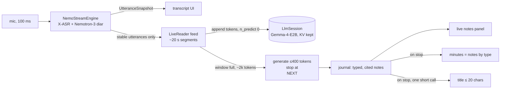

# Integrating the realtime meeting reader into VoxSumDroid

**Current model: mobile-v1** (2026-10-03), a `.litertlm` file for LiteRT-LM that runs on the **CPU within a 3 GB RAM budget**: see **§12**, which supersedes the llama.cpp path for new integrations. The llama.cpp GGUFs stay available: v11 (most precise decisions among them) and v8 (widest coverage). v0.45 integrates v3; §9–§11 list the changes from v3 to v11.

One model, three jobs: it **reads the meeting live** and writes notes (§4.3), then, at stop, it **titles the meeting** (§4.6) and **writes the prose summary** (§4.7) from those notes. From v8 on, all three are fine-tuned; v11 has the most precise decisions and the best titles.

A note for the [VoxSumDroid](https://github.com/vieenrose/VoxSumDroid) maintainer: how to reuse this project's summarizer so that **ASR, diarization and summarization run in parallel while the meeting is recorded**. The minutes are then ready about a minute after the meeting ends, instead of after a separate summarization phase.

The note is written against VoxSumDroid `66defa3` (2026-09-29) and this repo's `eval/phone_live.py`, the reference implementation measured on a Reno7.

## 1. What you get

| | |
|---|---|
| model | [`Luigi/gemma-4-E2B-meeting-agent-zh-GGUF`](https://huggingface.co/Luigi/gemma-4-E2B-meeting-agent-zh-GGUF): Gemma-4-E2B, as a LiteRT-LM `.litertlm` (mobile-v1) or a llama.cpp Q4_0 GGUF (v3–v11), Apache-2.0 |
| file (mobile-v1, recommended) | `mobile-v1/gemma-4-E2B-meeting-agent-zh-mobile-v1.litertlm`, 2,588,138,320 bytes, sha256 `45664b0a6a6d02b3d9a7c388bee69657d69320e25571f36cf22ceff8fb54232c`, HF revision `6fbe081eed5fae4ba82d0319896d633a20812d5d`; LiteRT-LM, CPU, 4k context: **§12** |
| file (v11) | `v11/gemma-4-E2B-meeting-agent-zh-v11-Q4_0.gguf`, 3,349,515,904 bytes, sha256 `16c69abb76e09821bdd08a022091dbb9b84620cc589491f36d294e6ee92f73f0`, HF revision `a862b705f3aaf7edee2018f4e3abae286826f11d` |
| system prompt (v11) | `v11/system_prompt.txt` at the same revision; identical to v5's and v8's |
| file (v8) | `v8/gemma-4-E2B-meeting-agent-zh-v8-Q4_0.gguf`, sha256 `7a1d8b6a1add7004744b309f625e8b0d78c804cf5ac7c4642de6816d316ebbcb`, revision `05285be248875e2940ba79b7646637f35a46acf8` |
| file (v5, previous) | `v5/gemma-4-E2B-meeting-agent-zh-v5-Q4_0.gguf`, sha256 `c812c04c4c627c15847614873d187d72db793b4165ea32fd00f1cec451aa5344`, revision `958a8f29a0143184418196c36a78b4899c0c8996` |
| file (v3, previous) | `gemma-4-E2B-meeting-agent-zh-Q4_0.gguf` at the repo root, sha256 `560041008644c58501e28af80da46ecfdae250381442d1784e0d016dd499946c`, revision `8cc7dff1d1967a9ab373d9275176ce8e5df189e2` |
| output | short cited notes, typed `DECISION` / `ACTION` / `PROPOSAL` / `OPEN-ISSUE` / `NUMBER`, written window by window; the minutes are those notes grouped by type; at stop, a title (≤ 20 characters) and a cited prose summary written from the notes |
| quality, notes (v11) | 38 held-out zh-TW meetings, with the 8k restart budget used on the phone: coverage 0.89, gold decisions recalled 72 %, 決議事項 items really decided 71 %, **17 % of minutes statements contradicted** by the transcript (the 27B teacher: 11 %). v8: coverage 0.94, decisions recalled 77 %, 決議事項 62 %, 17 % contradicted |
| quality, title and prose (v11) | titles 4.21 / 5 on parliament meetings (v8 4.05; the 27B teacher: 4.45); prose: 8 % of sentences contradict the notes they were written from (the 27B teacher: 11 %) |
| live, Reno7 (Dimensity 900, 8 GB) | a 2 h 08 meeting replayed at 1×: 67 s median lag after each ~4 min window, 115 s max, no drift. This run **did not have ASR running alongside**; see §6. |

## 2. From two phases to three concurrent lanes

Today, `TranscriptionService` runs the ASR + diarization pass, releases both GGUFs, then loads the LLM. The live reader needs all three resident and working at once:



Three lanes on one CPU:

1. **ASR + diarization.** Unchanged, and it keeps priority: it is the only lane that cannot fall behind without losing audio.
2. **Feed (prefill).** As utterances become *stable*, the first `UtteranceSnapshot.stable` entries, which no longer change, the reader formats them and appends them to the LLM's KV cache with a prefill-only call. This is most of the LLM's work, and it happens while people talk.
3. **Turn (decode).** When about 2k tokens of transcript have accumulated (~4 min of speech), the reader closes the user turn and generates at most 5 notes. On the Reno7 this takes 30–100 s, and then the lane is idle again.

**Only stable utterances are fed.** The model cites `[h:mm:ss]` lines with speaker labels, and a line fed while its speaker is still provisional (`speakerDelaySec`, 15 s by default) would be wrong in the cache forever. Waiting for stability costs about 15 s of lag, which is fine against a 4-minute window.

**At stop:** flush the last partial window as one turn, assemble the minutes (§4.5), then make two short fresh calls with the same model on the journal: the title (§4.6) and the prose summary (§4.7). Release everything after that. Keep the existing post-hoc path (`CursorAgent` / `Summarizer`) for imported audio and for devices that cannot run the live mode (§6).

## 3. JNI changes: a session that keeps its KV cache

`nativeGenerate` clears the KV cache on every call (`llama_memory_clear`). That is right for independent map-reduce calls, and it defeats the live reader, whose whole economy is that **each request extends the cached sequence**. Add a session API next to it; the existing calls stay untouched.

```cpp
// llm_jni.cpp — sketch. One conversation per handle; the caller owns the token sequence.
struct LlmSession { LlmHandle* h; std::vector<llama_token> seq; int n_past = 0; };

// Tokenize with special-token parsing (template pieces) or without (transcript text).
jintArray nativeTokenize(jlong h, jstring text, jboolean parseSpecial);

// Prefill-only: decode tokens[n_past..] and keep them. Returns n_past. No sampling, no clear.
jint nativeAppend(jlong h, jintArray tokens);

// Decode from the current state. Stops at the stop string or maxTokens, streams pieces, and
// APPENDS the generated tokens to the sequence (so the next turn extends it).
jstring nativeGenerateContinue(jlong h, jint maxTokens, jstring stop, jobject onToken);

// Restart: llama_memory_clear + seq.clear(); the caller then appends a fresh prefix.
void nativeReset(jlong h);
```

Context parameters for this model:

| parameter | value | why |
|---|---|---|
| `swa_full` | **`false`** | `llama_context_default_params()` sets it to `true`. That gives Gemma's sliding-window layers full attention, which costs a lot at depth on a phone CPU. The reader only ever appends, so the SWA cache never has to roll back. |
| `n_ctx` | 12288 | The reader restarts at 8k (§4.4); leave room for the window and the output. On 38 held-out sessions the 8k budget loses nothing against 32k, and gold decisions recalled rise from 77 % to 83 %. |
| KV | q8_0 + flash attention, as today | +11 % prefill at 8k depth on the Reno7, and half the KV memory |
| threads | the existing `pin_to_big_cores` policy | On the Dimensity 900 it merges 2×A78 and 6×A55 (0.83 ≥ `kMergeRatio`) into 8 threads, which was also our measured best: pp 25.6 tok/s at 8 threads against 17.0 at 2. |
| repack | **measure** `use_extra_bufts=false` on a `dotprod` device | All our Reno7 numbers are with repack on (llama.cpp default). Q4_0 relies on the ARM repack for its dotprod kernels, so no-repack may cost prefill speed. On an ARMv8.0 CPU without `dotprod` (Raspberry Pi 4) llama.cpp does not repack Q4_0 at all, so the flag changes nothing there. |

`nativeGenerateContinue` must add the stop string (`\nNEXT`) back into the sequence when it stops on it, so the history equals what was generated. The generated tokens themselves are already in the cache, so the next `nativeAppend` continues cleanly.

## 4. The protocol, exactly

The model was fine-tuned on this protocol. Deviations, such as another system prompt, another template or another line format, silently cost quality.

### 4.1 Chat template (Gemma 4, thinking off)

```
<bos><|turn>system\n{SYSTEM}<turn|>\n
<|turn>user\n{JOURNAL}<turn|>\n<|turn>model\nNEXT<turn|>\n
<|turn>user\n## 逐字稿片段 {k}\n{lines…}<turn|>\n<|turn>model\n{notes…}\nNEXT<turn|>\n
<|turn>user\n## 逐字稿片段 {k+1}\n …
```

- `{SYSTEM}` = [`v11/system_prompt.txt`](https://huggingface.co/Luigi/gemma-4-E2B-meeting-agent-zh-GGUF/blob/main/v11/system_prompt.txt), verbatim (the same text as `v5/` and `v8/system_prompt.txt`). Each model version was trained with its own prompt: never pair the v5 or v8 weights with the v3 prompt, or the reverse.
- `{JOURNAL}` = `## 筆記本（至今）\n` followed by the journal lines, or `（尚無筆記）` at the start.
- `ChatTemplate` needs a `GEMMA4` entry. Tokenize the template pieces with special-token parsing, and the transcript text without it.

### 4.2 Transcript lines

One line per stable utterance: `[{ts}] S{speaker+1}: {text}`. `{ts}` is `m:ss` under an hour and `h:mm:ss` from an hour on, as in `TranscriptFormat`. The labels are the diarizer's; the model is trained not to repeat them in notes, but it uses them to tell speakers apart.

- Feed segments of about 20 s. Our measurements show chunk size barely matters: 36–40 tok/s from 32 to 512 tokens.
- Close a window at about **2,000 tokens** of transcript lines. We sized windows with a Qwen tokenizer, and Gemma's count is close enough.
- Split a line longer than a window, as `CursorChunker` already does.

### 4.3 A reading turn

Generate with `maxTokens = 400`, stop at `\nNEXT`, temperature 0.2. Parse only the lines matching:

```
^\s*NOTE\s*\[?(\d+:\d{2}(?::\d{2})?)\]?\s*(?:\((\w[\w-]*)\)\s*)?(.+)$
```

Guards, which are part of the deployed configuration:
- keep at most 6 notes per turn;
- drop a note whose time does not resolve to a transcript line;
- drop a note that repeats one of the last 30: character-bigram Jaccard > 0.6.

Append kept notes to the journal as `#{id} [{ts}] ({TYPE}) {text}`.

### 4.4 Restart at 8k tokens

On the Reno7, prefill slows sharply with context depth:

| context in cache | 0 | 4k | 8k | 16k |
|---|---|---|---|---|
| prefill (tok/s) | 34.9 | 12.2 | 7.9 | 4.6 |

Before starting a window, if `seq.size + 4,000 + 400 + 600 > 8,192`:
1. call `nativeReset`;
2. compact the journal to about 2,500 tokens, in this order: `DECISION`, then `OPEN-ISSUE`, then `ACTION`, newest first within each, then the most recent other notes. Keep ids and chronological order, and add `（另有 N 則較早的筆記未列出）` for the rest;
3. append a fresh prefix: system, compacted journal, `NEXT`.

The fresh prefill (30–50 s) runs at the start of a window, while the next lines are still being spoken. See `compact()` in `eval/phone_live.py`.

### 4.5 Minutes

The model does not write the minutes: small models merge and invent at a reduce step. Assemble them from the journal:

```
【決議事項】 DECISION notes · 【待辦與負責人】 ACTION · 【保留與未決】 OPEN-ISSUE · 【討論要點】 PROPOSAL · 【重要數字】 NUMBER
- {text} [{ts}]        (or "- 無" for an empty section)
```

Every item keeps its `[ts]`, so the existing tap-to-play works on it directly. The title and the prose summary are written from the same journal, by the same model (§4.6, §4.7).

### 4.6 Title

At stop, after the last reading turn, make **one short, fresh call**. It is not a turn of the reading conversation: call `nativeReset`, or use a second handle.

- **Input.** The *whole* journal, each note rendered as in the journal (`#{id} [{ts}] ({TYPE}) {text}`, without `({TYPE})` for an untyped note), in a single user turn, with no system turn and thinking off:

  ```
  以下是一場會議的筆記：

  {journal, one note per line}

  為這場會議寫一個標題，不超過 20 個字。只輸出標題。
  ```

  This is VoxSumDroid's own `ReaderLane.title` prompt (v0.45.1), and v8 was trained on exactly that. Keep it **byte for byte**: the training used this text, not a paraphrase. The reference copy is `title_prompt()` in [`eval/conversion_prompts.py`](../eval/conversion_prompts.py).
- **Generation.** `maxTokens = 48`, temperature 0.2, stop at `<turn|>`.
- **Cleaning,** as `ReaderLane.title` does (`clean_title()`): keep the first non-blank line, strip `「」"*#` and spaces, and cut at 40 characters.
- **Fallback.** If the call fails, or the title is empty or over 20 characters, keep VoxSumDroid's existing title step. On 58 held-out meetings, v8 went over 20 characters once (one parliament meeting).
- **Cost on the Reno7.** About 1–2 min: a prefill of a few thousand tokens at shallow depth, plus ~20 tokens of decode. It can run while the minutes are assembled.

**Quality.** The judge (Gemma-4-31B) scores each title 1–5 against the notes and the reference key points:

| | parliament (IVOD, 38) | business (AliMeeting, 20) |
|---|---|---|
| v5 (not trained for titles) | 4.18 | 5.0 |
| v8 | 4.05 | 5.0 |
| **v11** | **4.21** | — |
| Qwen3.8-27B teacher (upper bound) | 4.45 | 5.0 |

Titles were already good without training. On parliament meetings, the gap to the teacher is a title that names the committee or one bill instead of the main issue. v11 narrows it (4.21).

### 4.7 A prose summary

The minutes (§4.5) remain the reference: every item is a note with its `[ts]`. The prose summary is a **style conversion** of those notes, not a second reading of the meeting. It must say nothing the notes do not say, and it carries the notes' citations so that every sentence stays tap-to-play. From v8 on, the model is fine-tuned for exactly this.

- **Input.** The same call shape as the title: a fresh call, the whole journal, no system turn, thinking off. The prompt is VoxSumDroid's `ReaderLane.prose` (v0.45.1), byte for byte (`prose_prompt()` in [`eval/conversion_prompts.py`](../eval/conversion_prompts.py)):

  ```
  以下是一場會議的筆記：

  {journal, one note per line}

  根據這些筆記，用連貫的段落寫一份會議摘要（不要條列、不要標題），說明討論了什麼、決定了什麼、誰要做什麼、還有什麼沒解決。只寫筆記裡有的內容；提到某件事時在句尾附上筆記的時間，例如 [1:23]。
  ```

- **Generation.** `maxTokens = 600`, temperature 0.2, stop at `<turn|>`. The output is about 650 characters, 11–14 sentences.
- **Cleaning,** as `ReaderLane.prose` does (`clean_prose()`): remove every `[ts]` that is not a time present in the journal; drop bullet (`-`, `*`) and header (`#`) lines; join paragraphs with a blank line. v8 rarely needs it: no bullets or headers on 58 held-out meetings, and 9 invalid citations out of ~420 sentences on parliament meetings (v5: 27).
- **Cost on the Reno7.** The same prefill as the title, plus ~400 tokens of decode: about 2–3 min. Run it after the title, so the title appears first.
- **UI.** Show each `[ts]` as a tap-to-play link, as in the minutes, and label the paragraph as a machine summary of the notes.

**Quality.** The judge (Gemma-4-31B) checks every sentence against the notes it was written from (`eval/judge_prose_notes.py`). A sentence is *contradicted* if it changes a fact or turns a proposal into a decision, or an open issue into a settled one:

| | parliament (IVOD, 38) | business (AliMeeting, 20) |
|---|---|---|
| v5 (not trained for prose) | 9 % contradicted | 19 % |
| v8 | **8 %** | **12 %** |
| **v11** | **8 %** | — |
| Qwen3.8-27B teacher | 11 % | 19 % |

v8 is more faithful to the notes than its 27B teacher, because it was trained only on teacher summaries the judge found faithful, then reinforced on faithfulness. The prose adds no new errors beyond those 8–12 %. It does inherit the notes' own errors against the transcript (§7), which is why the citations matter.

**How it was trained.** Qwen3.8-27B wrote a summary and a title for 543 training journals with the prompts above. Only summaries with no sentence contradicting the notes, and in the requested form, were kept: 123 of the 543 summaries, plus 540 titles. A multi-task GRPO then rewarded faithfulness to the notes and form for the prose, the judge's 1–5 score for the title, and faithful, correctly typed notes with good recall for reading. Reading quality did not regress (§10).

### 4.8 v5 note types and the proposal guard

v5 makes the types strict:

| type | meaning | minutes section |
|---|---|---|
| `DECISION` | a decision announced in the meeting (通過, 決定, 定案, 同意照辦); a proposal is not one | 決議事項 |
| `ACTION` | an assigned task: someone is to do it, or a deadline is set | 待辦與負責人 |
| `PROPOSAL` | a suggestion or option still under discussion | 討論要點 |
| `OPEN-ISSUE` | held, disputed, or to be confirmed | 保留與未決 |
| `NUMBER` | a key figure | 重要數字 |

Also apply the harness guard at assembly time (`reclassify_proposals` in `eval/realtime_agent.py`): a `DECISION` or `ACTION` whose text matches `建議|提議|可考慮` (or starts with 建議, 提議, 可以, 可考慮, 考慮, 希望, 應該, 應, 或許, 是否, 討論, 研議), and contains none of 通過, 決定, 決議, 同意, 定案, is filed as `PROPOSAL`. The journal compaction (§4.4) treats `PROPOSAL` like the other untyped notes: after decisions, open issues and actions.

## 5. Kotlin shape

```kotlin
class LiveReader(private val llm: LlmSession, private val tok: (String, Boolean) -> IntArray) {
    private val journal = mutableListOf<Note>()
    private var windowTokens = 0; private var k = 0; private var fed = 0   // stable utterances consumed

    fun onSnapshot(s: TranscriptEvent.UtteranceSnapshot) {            // from NemoStreamEngine's Flow
        val fresh = s.utterances.subList(fed, s.stable); fed = s.stable
        if (fresh.isEmpty()) return
        if (windowTokens == 0) openWindow()                            // restart check + "## 逐字稿片段 k\n"
        val t = tok(fresh.joinToString("") { line(it) + "\n" }, false)
        llm.append(t); windowTokens += t.size                          // prefill while people talk
        if (windowTokens >= 2000) closeWindow()
    }
    private fun closeWindow() {                                        // on a low-priority worker
        llm.append(tok("<turn|>\n<|turn>model\n", true))
        val reply = llm.generateContinue(maxTokens = 400, stop = "\nNEXT")
        journal += parseNotes(reply)                                   // §4.3 guards
        llm.append(tok("<turn|>\n<|turn>user\n", true)); windowTokens = 0
    }
}
```

- Run `append` and `generateContinue` on one dedicated LLM thread, and **serialize every session call**, since the cache is a single sequence. Snapshots arrive faster than turns finish, so queue the lines and never drop them.
- Give the LLM thread a lower priority than the ASR thread. If the reader falls behind, it catches up during pauses; ASR never waits for it.
- Surface `journal` as a Flow of live notes to the UI. Tap-to-play works through each note's `ts`.

## 6. Resource budget: verify before shipping

| | measured | to measure in the app |
|---|---|---|
| LLM weights | 3.35 GB file (mmap) | RSS with repack on and off |
| KV at 12k, q8_0 | small next to the weights | — |
| ASR + diarization | — | RSS and CPU share when they run alongside the LLM |
| speed while live | prefill 16 tok/s, decode 4.5 tok/s effective (half the cold benchmark) | the same, with ASR competing for the big cores |
| heat | battery 30 → 37 °C over 2 h 10, LLM alone | with all three lanes |

- **4 GB devices.** On a Raspberry Pi 4 (A72, 3.8 GB), the model loads in mmap with about 2–2.8 GB resident, nearly all file-backed, and runs at prefill 5 tok/s and decode 2.2 tok/s. That is fine for the post-hoc path and too slow for live. Loaded without a memory cap next to 1.6 GB of other processes, it froze the Pi until it rebooted. Keep the LLM out of a 4 GB device's live path.
- **Gate the live mode** on RAM, for example ≥ 8 GB total. Below that, keep the current two-phase pipeline and run the reader after transcription: the protocol is the same, only faster than real time, since nothing waits for speech.
- **Fallback when the reader lags.** If it falls behind by more than a window, keep feeding and delay turns. Nothing is lost, and the tail is processed right after stop. Log the lag per window, as `phone_live.py` does in `events`.
- **Parity test.** Run `eval/phone_live.py` and the Kotlin reader on the same transcript at `--speed 20`. The token sequences must match exactly, which is the cheapest guard against a template or format drift.

## 7. What the UI should say

About one statement in five is contradicted by the transcript. The errors are mostly relational: the right figure attached to the wrong year or body. So:
- Show every note with its timestamp, and make it tap-to-play. That is how a user checks a note in two seconds.
- Label the live panel as notes, not as authoritative minutes.
- The most error-prone sections are the key figures (`NUMBER`, ~22 % contradicted) and decisions (~19 %). Consider a "verify" affordance on those two.

## 8. Licences and data

- The model is Apache-2.0, like its Gemma-4 base, and compatible with VoxSumDroid's GPL-3.0. It is downloaded at runtime like the other models: pin it in `ModelManager` with the revision and sha256 from §1.
- The model was trained on Legislative Yuan (IVOD) transcripts. No data ships with it. The source recordings are under the IVOD terms of use.

## 9. Moving from v3 to v5

| | v3 (VoxSumDroid v0.45) | v5 |
|---|---|---|
| weights | root `gemma-4-E2B-meeting-agent-zh-Q4_0.gguf` | `v5/gemma-4-E2B-meeting-agent-zh-v5-Q4_0.gguf` (same size and layout) |
| system prompt | root `system_prompt.txt` | `v5/system_prompt.txt` |
| note types | `DECISION` `ACTION` `OPEN-ISSUE` `NUMBER` | adds `PROPOSAL`; `DECISION` and `ACTION` strict |
| minutes | 4 sections | adds 討論要點 (§4.5), plus the proposal guard (§4.8) |
| training data | 163 IVOD sessions | 163 IVOD + 217 AliMeeting business meetings |

Everything else is unchanged: the template, the line format, the regex, the guards, the 8k restart, the title and prose calls.

Why: on AliMeeting business meetings, v3 filed proposals under 決議事項 ("建議申請兩三套洗碗機") and listed every idea discussed as an action. On 20 AliMeeting meetings not used in training:

| | v3 | **v5** |
|---|---|---|
| **AliMeeting, 20 meetings (not in training)** | | |
| minutes contradicted | 16 % | 16 % |
| notes contradicted | 17 % | **14 %** |
| coverage | 0.86 | **0.88** |
| 決議事項 items really decided | 58 % (276 items) | **76 %** (117) |
| 待辦 items really assigned | 40 % (355 items) | **66 %** (138) |
| **IVOD, 38 held-out sessions** | | |
| minutes contradicted | 18 % | 18 % |
| coverage | 0.92 | 0.92 |
| 決議事項 items really decided | 51 % (904 items) | **61 %** (682) |
| 待辦 items really assigned | 53 % (1,097 items) | **64 %** (517) |
| gold decisions recalled (keyword-matched) | 83 % | 78 % |
| notes per session | 89 | 104 |
| phone lag, median / p90 / max | 2.8 / 4.9 / 17.6 min | 2.8 / 5.9 / 24.9 min |

- **Both domains:** v5 files far fewer proposals as decisions and ideas as tasks. On parliament meetings, where precision was low too, it rises by about 10 points, and faithfulness and coverage do not change.
- The fall in keyword-matched decision recall is expected: that metric counts gold notes containing 決定 or 決議, and v3 scored on it partly by filing proposals as decisions.
- **To watch:** v5 writes more notes on IVOD (104 per session, against 89), which lengthens the worst-case lag on dense 4-hour meetings. The median is unchanged. 19 % of IVOD action items are judged unsupported, which is worth a look in the UI (§7).

**Recommendation: move to v5.**

## 10. Moving from v5 to v8

| | v5 | v8 |
|---|---|---|
| weights | `v5/gemma-4-E2B-meeting-agent-zh-v5-Q4_0.gguf` | `v8/gemma-4-E2B-meeting-agent-zh-v8-Q4_0.gguf` (same size and layout) |
| system prompt | `v5/system_prompt.txt` | `v8/system_prompt.txt`, **identical** |
| reading protocol | — | unchanged: template, line format, types, guards, 8k restart |
| title and prose calls | general ability | **fine-tuned**, on `ReaderLane.title` / `ReaderLane.prose` exactly (§4.6, §4.7) |
| training | SFT | SFT + conversion SFT + multi-task GRPO |

The switch is a file swap: change the path, revision and sha256 in `ModelManager`. Keep the two conversion prompts byte for byte; if `ReaderLane` changes them, tell this project, so the next version is trained on the new text.

Held-out results (judge: Gemma-4-31B):

| | v5 | **v8** |
|---|---|---|
| **IVOD, 38 held-out sessions** | | |
| coverage | 0.92 | **0.94** |
| minutes contradicted | 18 % | **17 %** |
| 決議事項 items really decided | 61 % | **62 %** |
| 待辦 items really assigned | 64 % | **68 %** |
| gold decisions recalled (keyword-matched) | 78 % | 77 % |
| notes per session | 104 | 104 |
| phone lag, worst case (model) | 24.9 min | **17.4 min** |
| prose: sentences contradicting the notes | 9 % | **8 %** |
| title (1–5) | 4.18 | 4.05 |
| **AliMeeting, 20 meetings (not in training)** | | |
| coverage | 0.88 | 0.88 |
| 決議事項 items really decided | 76 % | **79 %** |
| 待辦 items really assigned | 66 % | **68 %** |
| prose: sentences contradicting the notes | 19 % | **12 %** |
| title (1–5) | 5.0 | 5.0 |

**Recommendation: move to v8.** It reads at least as well as v5, and its prose is clearly more faithful to the notes, especially on business meetings. Titles are on par: the 0.13 gap on parliament meetings is within the noise of 38 meetings.

## 11. Moving from v8 to v11

| | v8 | v11 |
|---|---|---|
| weights | `v8/gemma-4-E2B-meeting-agent-zh-v8-Q4_0.gguf` | `v11/gemma-4-E2B-meeting-agent-zh-v11-Q4_0.gguf` (same size and layout) |
| system prompt, protocol, title and prose calls | — | **unchanged**: a file swap |
| training | v5 data + conversion SFT + multi-task GRPO | v8 + a contrastive DPO on 2,700 single-span pairs: one note of a teacher reply altered to the wrong object, the wrong body or an inverted result |

IVOD, 38 held-out sessions (judge: Gemma-4-31B):

| | v5 | v8 | **v11** |
|---|---|---|---|
| minutes contradicted | 18 % | 17 % | 17 % |
| coverage | 0.92 | **0.94** | 0.89 |
| gold decisions recalled | **78 %** | 77 % | 72 % |
| 決議事項 items really decided | 61 % (682 items) | 62 % (663) | **71 %** (493) |
| 待辦 items really assigned | 64 % | **68 %** | 66 % |
| prose: sentences contradicting the notes | 9 % | 8 % | 8 % |
| title (1–5) | 4.18 | 4.05 | **4.21** |
| phone lag, worst case (model) | 24.9 min | 17.4 min | **17.3 min** |

**What changes for the user.**
- The 決議事項 section is shorter and more reliable. Of the decisions it lists, 71 % were really decided, against 62 % for v8. The proposals it no longer calls decisions move to 討論要點.
- The title is better.
- It covers less of the meeting (0.89 against 0.94), and recalls fewer of the decisions a human would list.
- Faithfulness to the transcript is unchanged: about one statement in six is still contradicted, so §7 holds as is.

**Recommendation.** Ship v11 as the default if the decisions section and the title are what users read first. Keep v8 selectable (same protocol, same prompts) for users who want the widest coverage. Both can be pinned in `ModelManager`; switching is a file swap.

## 12. LiteRT-LM: the mobile model (recommended)

**mobile-v1** is the reader as a **`.litertlm` file for [LiteRT-LM](https://github.com/google-ai-edge/LiteRT-LM)**, Google's on-device runtime. It replaces the llama.cpp GGUF for VoxSumDroid. The prompts, template, line format, note types, guards, title and prose calls of §4 are unchanged. Two things change: the runtime calls (§12.3), and a **4k context with a fresh session per window** (§12.4), which keeps the model within a 3 GB RAM budget.

### 12.1 The file

| | |
|---|---|
| file | `mobile-v1/gemma-4-E2B-meeting-agent-zh-mobile-v1.litertlm`, 2,588,138,320 bytes, sha256 `45664b0a6a6d02b3d9a7c388bee69657d69320e25571f36cf22ceff8fb54232c`, HF revision `6fbe081eed5fae4ba82d0319896d633a20812d5d` |
| runtime | `com.google.ai.edge.litertlm:litertlm-android:0.17.1`, the version this was measured with |
| system prompt | `mobile-v1/system_prompt.txt`: the same text as v5, v8 and v11 |
| graph | Google's Gemma-4-E2B **mobile** graph ([`litert-community/gemma-4-E2B-it-litert-lm`](https://huggingface.co/litert-community/gemma-4-E2B-it-litert-lm), Apache-2.0): int2 MLP in layers 15–34, int4 elsewhere, int8 KV cache, int8 static-range activations, Google's MTP drafter for speculative decoding |
| weights | our fine-tune, written as integers into that graph on Google's own scales and bit widths: same size and kernels as Google's file |
| changes to Google's file | (1) **fp32 activations on GPU**. Google's file asks for fp16, and on the Mali-G68 fp16 corrupts every prompt longer than a few thousand tokens, Google's own model included (timestamps come out as `[2:4:43:3]`). (2) The `prefill_1024` signature is disabled, so the runtime prefills in blocks of 128. Its attention buffers, sized by the whole cache, were most of the peak memory, and prefill is faster without it. |

The file still holds Google's audio and vision sections. The reader never loads them: pass `null` for the vision and audio backends.

### 12.2 Recommended settings

**Use the CPU.** On the Reno7 it fits a 3 GB budget, decodes faster than the GPU, and prefills almost as fast. The GPU path is correct only with fp32 activations, and then it needs 3.5 GB.

| | **CPU** (recommended) | GPU (only with more than 3.5 GB available) |
|---|---|---|
| backend | `Backend.CPU(threadCount = 8)` | `Backend.GPU()` |
| `maxNumTokens` | **4096** | **4096** |
| speculative decoding | **off**: it gains nothing on CPU | **on**: `ExperimentalFlags.enableSpeculativeDecoding = true` before creating the engine (decode 1.7× faster, same greedy output) |
| `cacheDir` | the app's cache dir: the XNNPACK weight cache (~0.8 GB on disk). The first run builds it; later inits take 0.4 s | the app's cache dir: compiled GPU program and weights (~0.8 GB). First init ~45 s, then ~5 s |
| sampler | `SamplerConfig(topK = 40, topP = 0.95, temperature = 0.2, seed = 0)`, as in §4.3 | same |
| activations | int8 static ranges, from the graph | fp32, already set in the file. **Never repack it with fp16**: on the Mali-G68, fp16 corrupts the output even at 2.9k tokens |

```kotlin
ExperimentalFlags.enableSpeculativeDecoding = useGpu      // once, before the Engine; false on CPU
val engine = Engine(EngineConfig(
    modelPath = file.absolutePath,
    backend = if (useGpu) Backend.GPU() else Backend.CPU(threadCount = 8),
    visionBackend = null, audioBackend = null,
    maxNumTokens = 4096,
    cacheDir = context.cacheDir.path))
engine.initialize()
val sessionConfig = SessionConfig(SamplerConfig(topK = 40, topP = 0.95, temperature = 0.2, seed = 0))
```

Use `useGpu = false` unless the device has RAM to spare. Run every call on one dedicated LLM thread, and keep **one session open at a time**.

### 12.3 The protocol on the Session API

`Session.runPrefill` takes raw text and parses the template's special tokens, so the template of §4.1 is written as text. Do not write `<bos>`: the engine adds it. We checked on the Reno7 that feeding a window in several `runPrefill` calls gives the same notes as one prefill of the whole prompt.

**One session per window.** With a 4k context, each reading window gets a fresh session:

```kotlin
fun readWindow(k: Int, journal: String, lines: Flow<String>): String {
    engine.createSession(sessionConfig).use { s ->
        s.runPrefill(text("<|turn>system\n$SYSTEM<turn|>\n<|turn>user\n$journal<turn|>\n" +
                          "<|turn>model\nNEXT<turn|>\n<|turn>user\n## 逐字稿片段 $k\n"))
        // feed stable lines as they arrive, in segments of >= ~500 characters
        lines.collect { s.runPrefill(text(it)) }
        s.runPrefill(text("<turn|>\n<|turn>model\n"))
        return s.runDecode()            // the notes, ending with NEXT; stops at <turn|> by itself
    }
}
private fun text(t: String) = listOf(InputData.Text(t))
```

- **`{journal}`** is `## 筆記本（至今）\n` plus the journal **compacted to ≤ 1,200 tokens** (§4.4: decisions first, then open issues, then actions, newest first within each), or `（尚無筆記）` at the start.
- **Close a window** at **1,500 tokens** of transcript lines, not 2,000. The prompt then stays under ~3.7k tokens, and the reply under 400.
- **Token counts.** The Kotlin API has no tokenizer. For zh-TW, count **1.63 characters per token** (measured on our prompts).
- **Feed sizes.** Each `runPrefill` call costs about 1.3 s of fixed overhead on the GPU, so feed segments of at least ~500 characters (about 20–30 s of speech).
- **Output cap.** Version 0.17.1 has no maximum output length in Kotlin. The model ends every reply with `NEXT<turn|>` on its own. As a guard, decode with `generateContentStream` and call `session.cancelProcess()` once the reply holds `\nNEXT` or about 650 characters (400 tokens).
- **Title and prose** (§4.6, §4.7): a fresh session, `runPrefill("<|turn>user\n{prompt}<turn|>\n<|turn>model\n")`, then `runDecode()`. Both stop at `<turn|>` by themselves. **Compact the journal first**: a whole meeting's journal (~130 notes) is longer than the 4k context. Keep at most **3,900 characters** of notes (~2.4k tokens), chosen as in §4.4 (decisions, then open issues, then actions, newest first within each, then the most recent other notes), in chronological order (`compact_notes()` in [`eval/conversion_prompts.py`](../eval/conversion_prompts.py)). Without it, most calls fail or truncate: titles fall from 4.05 to 3.67.
- **If you keep one session across windows** (the §4 protocol with a 8k context), start each new user turn with `"\n<|turn>user\n…"`, **without** `<turn|>`. LiteRT-LM keeps the stop token it sampled as the next input, so it is already in the cache (`tasks.cc`: "add the stop token as pending token"). Writing it again would put two in the history.

### 12.4 Quality

Evaluated through LiteRT-LM itself, on the 38 held-out IVOD sessions, with the harness and judge of §9–§11. The runs used the host's GPU backend (fp32 activations). The phone's CPU backend computes with int8 activations, and gave the same notes on our spot checks. The 4k column uses the per-window protocol of §12.3, and title and prose calls on a journal compacted to 3,900 characters.

| | v8 (llama.cpp, 8k) | v11 (llama.cpp, 8k) | **mobile-v1, 8k** | **mobile-v1, 4k (shipped)** |
|---|---|---|---|---|
| minutes contradicted | 17 % | 17 % | 17 % | **17 %** |
| unsupported | 5 % | 5 % | 6 % | 5 % |
| coverage | **0.94** | 0.89 | 0.91 | 0.92 |
| 決議事項 items really decided | 62 % | 71 % | **79 %** | 75 % |
| 待辦 items really assigned | **68 %** | 66 % | 67 % | 66 % |
| prose: sentences contradicting the notes | 8 % | 8 % | 9 % | 10 % |
| title (1–5) | 4.05 | **4.21** | 4.08 | 4.05 |

mobile-v1 is as faithful as v11, with better coverage and a more precise decision section. The 4k context costs almost nothing: the same faithfulness, decisions slightly less precise (75 % against 79 % at 8k), titles and prose on a compacted journal within a point of the 8k figures. Its prose is longer than v11's (~1,000 characters, against ~650).

### 12.5 Speed and memory on the Reno7

Measured with this file on the Reno7 (Dimensity 900, 8 GB), `maxNumTokens = 4096`, on a 2,881-token reading prompt: system, a journal of 1,167 tokens, and a window of 1,208 tokens. These are single runs, with nothing else running (no ASR alongside). Peak memory is the largest of `dumpsys meminfo` TOTAL RSS, sampled every 3 s, and `VmHWM`.

| | **CPU, 8 threads** | GPU fp32 + MTP drafter | GPU fp16 (Google's setting) |
|---|---|---|---|
| prefill | **118 tok/s** (25 s) | 128 tok/s (22 s) | 162 tok/s |
| decode | **~9.8 tok/s** | ~7.5 tok/s | — |
| engine init | 0.4 s (cache built) | 5 s (cache built) | — |
| **peak RSS** | **2.28 GB** (0.97 GB of it anonymous) | 3.52 GB (2.65 GB of it GPU driver memory) | 2.78 GB |
| output | correct | correct | **corrupt** (`[2:444:24]`) |
| first run ever (builds the cache) | 3.13 GB peak, init 6 s | 3.61 GB, init 43 s | — |

- **Per window**, on CPU: ~25 s of prefill (system + journal + window) and 15–40 s of decode. A 1,500-token window is about 3–4 min of speech, so the reader keeps up with a live meeting with time to spare. Feeding lines as they arrive (§12.3) hides most of the prefill.
- **The first run** builds the XNNPACK cache and peaks at 3.13 GB, once per install (or after a library update). Do it when the model is downloaded, before any recording, with nothing else loaded.
- **Against llama.cpp** (v11 Q4_0 at 8k, §4.4), the reader prefills 15× faster and decodes 1.5–2× faster.
- **Why 4k.** The graph's attention buffers are sized by the whole cache, at every layer, so memory grows quickly with `maxNumTokens`. On an x86 host with the same graph, the peak is 1.06 GB at 4k, 2.92 GB at 8k, and 4.47 GB at 8k with Google's `prefill_1024`. The KV cache itself is int8 and small: ~75 MB at 8k.

**Still to measure in the app:** the same with ASR and diarization resident, and heat over a full meeting.

### 12.6 How it was built

1. **Fine-tune on Google's mobile weights.** A LoRA trained in float, with Google's int8 activation ranges in the loop (`distill/sft_mobile_qat.py`). The loss distils v11: 0.7 × cross-entropy on v11's top-32 next-token distributions, plus 0.3 × cross-entropy on the gold (`distill/kd_teacher_logits.py`). This carries v8's GRPO and v11's contrastive DPO without porting them to the mobile weights.
2. **GPTQ onto Google's grid.** Rounding the merged weights to the nearest integer erases the fine-tune: almost every change is below half a 2-bit or 4-bit step. GPTQ instead rounds one input column at a time and pushes each rounding error onto the columns not yet rounded, with Google's per-channel scales held fixed (`distill/gptq_mobile.py`). About 0.2 % of the integers change.
3. **Injection.** Those integers are written into Google's `.tflite`, bit for bit. The file is then repacked with fp32 GPU activations, and with the `prefill_1024` signature disabled (`distill/inject_litertlm.py`).
