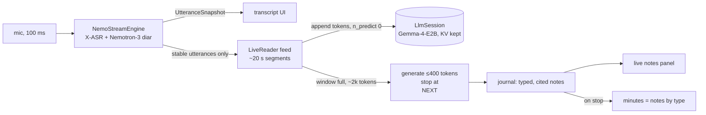

# Integrating the realtime meeting reader into VoxSumDroid

A note for the [VoxSumDroid](https://github.com/vieenrose/VoxSumDroid) maintainer: how to reuse this project's summarizer so that **ASR, diarization and summarization run in parallel while the meeting is recorded**. The minutes are then ready about a minute after the meeting ends, instead of after a separate summarization phase.

The note is written against VoxSumDroid `66defa3` (2026-09-29) and this repo's `eval/phone_live.py`, the reference implementation measured on a Reno7.

## 1. What you get

| | |
|---|---|
| model | [`Luigi/gemma-4-E2B-meeting-agent-zh-GGUF`](https://huggingface.co/Luigi/gemma-4-E2B-meeting-agent-zh-GGUF): Gemma-4-E2B QAT, Q4_0, Apache-2.0 |
| file | `gemma-4-E2B-meeting-agent-zh-Q4_0.gguf`, 3,349,515,904 bytes, sha256 `560041008644c58501e28af80da46ecfdae250381442d1784e0d016dd499946c`, HF revision `8cc7dff1d1967a9ab373d9275176ce8e5df189e2` |
| output | short cited notes, typed `DECISION` / `ACTION` / `OPEN-ISSUE` / `NUMBER`, written window by window; the minutes are those notes grouped by type |
| quality | 38 held-out zh-TW meetings, with the 8k restart budget used on the phone: coverage 0.92, gold decisions recalled 83 %, **18 % of statements contradicted** by the transcript (the 27B teacher: 11 %) |
| live, Reno7 (Dimensity 900, 8 GB) | a 2 h 08 meeting replayed at 1×: 67 s median lag after each ~4 min window, 115 s max, no drift. This run **did not have ASR running alongside**; see §6. |

## 2. From two phases to three concurrent lanes

Today, `TranscriptionService` runs the ASR + diarization pass, releases both GGUFs, then loads the LLM. The live reader needs all three resident and working at once:



Three lanes on one CPU:

1. **ASR + diarization.** Unchanged, and it keeps priority: it is the only lane that cannot fall behind without losing audio.
2. **Feed (prefill).** As utterances become *stable*, the first `UtteranceSnapshot.stable` entries, which no longer change, the reader formats them and appends them to the LLM's KV cache with a prefill-only call. This is most of the LLM's work, and it happens while people talk.
3. **Turn (decode).** When about 2k tokens of transcript have accumulated (~4 min of speech), the reader closes the user turn and generates at most 5 notes. On the Reno7 this takes 30–100 s, and then the lane is idle again.

**Only stable utterances are fed.** The model cites `[h:mm:ss]` lines with speaker labels, and a line fed while its speaker is still provisional (`speakerDelaySec`, 15 s by default) would be wrong in the cache forever. Waiting for stability costs about 15 s of lag, which is fine against a 4-minute window.

**At stop:** flush the last partial window as one turn, assemble the minutes (§4.5), then release everything. Keep the existing post-hoc path (`CursorAgent` / `Summarizer`) for imported audio and for devices that cannot run the live mode (§6).

## 3. JNI changes: a session that keeps its KV cache

`nativeGenerate` clears the KV cache on every call (`llama_memory_clear`). That is right for independent map-reduce calls, and it defeats the live reader, whose whole economy is that **each request extends the cached sequence**. Add a session API next to it; the existing calls stay untouched.

```cpp
// llm_jni.cpp — sketch. One conversation per handle; the caller owns the token sequence.
struct LlmSession { LlmHandle* h; std::vector<llama_token> seq; int n_past = 0; };

// Tokenize with special-token parsing (template pieces) or without (transcript text).
jintArray nativeTokenize(jlong h, jstring text, jboolean parseSpecial);

// Prefill-only: decode tokens[n_past..] and keep them. Returns n_past. No sampling, no clear.
jint nativeAppend(jlong h, jintArray tokens);

// Decode from the current state. Stops at the stop string or maxTokens, streams pieces, and
// APPENDS the generated tokens to the sequence (so the next turn extends it).
jstring nativeGenerateContinue(jlong h, jint maxTokens, jstring stop, jobject onToken);

// Restart: llama_memory_clear + seq.clear(); the caller then appends a fresh prefix.
void nativeReset(jlong h);
```

Context parameters for this model:

| parameter | value | why |
|---|---|---|
| `swa_full` | **`false`** | `llama_context_default_params()` sets it to `true`. That gives Gemma's sliding-window layers full attention, which costs a lot at depth on a phone CPU. The reader only ever appends, so the SWA cache never has to roll back. |
| `n_ctx` | 12288 | The reader restarts at 8k (§4.4); leave room for the window and the output. On 38 held-out sessions the 8k budget loses nothing against 32k, and gold decisions recalled rise from 77 % to 83 %. |
| KV | q8_0 + flash attention, as today | +11 % prefill at 8k depth on the Reno7, and half the KV memory |
| threads | the existing `pin_to_big_cores` policy | On the Dimensity 900 it merges 2×A78 and 6×A55 (0.83 ≥ `kMergeRatio`) into 8 threads, which was also our measured best: pp 25.6 tok/s at 8 threads against 17.0 at 2. |
| repack | **measure** `use_extra_bufts=false` on a `dotprod` device | All our Reno7 numbers are with repack on (llama.cpp default). Q4_0 relies on the ARM repack for its dotprod kernels, so no-repack may cost prefill speed. On an ARMv8.0 CPU without `dotprod` (Raspberry Pi 4) llama.cpp does not repack Q4_0 at all, so the flag changes nothing there. |

`nativeGenerateContinue` must add the stop string (`\nNEXT`) back into the sequence when it stops on it, so the history equals what was generated. The generated tokens themselves are already in the cache, so the next `nativeAppend` continues cleanly.

## 4. The protocol, exactly

The model was fine-tuned on this protocol. Deviations, such as another system prompt, another template or another line format, silently cost quality.

### 4.1 Chat template (Gemma 4, thinking off)

```
<bos><|turn>system\n{SYSTEM}<turn|>\n
<|turn>user\n{JOURNAL}<turn|>\n<|turn>model\nNEXT<turn|>\n
<|turn>user\n## 逐字稿片段 {k}\n{lines…}<turn|>\n<|turn>model\n{notes…}\nNEXT<turn|>\n
<|turn>user\n## 逐字稿片段 {k+1}\n …
```

- `{SYSTEM}` = [`system_prompt.txt`](https://huggingface.co/Luigi/gemma-4-E2B-meeting-agent-zh-GGUF/blob/main/system_prompt.txt), verbatim.
- `{JOURNAL}` = `## 筆記本（至今）\n` followed by the journal lines, or `（尚無筆記）` at the start.
- `ChatTemplate` needs a `GEMMA4` entry. Tokenize the template pieces with special-token parsing, and the transcript text without it.

### 4.2 Transcript lines

One line per stable utterance: `[{ts}] S{speaker+1}: {text}`. `{ts}` is `m:ss` under an hour and `h:mm:ss` from an hour on, as in `TranscriptFormat`. The labels are the diarizer's; the model is trained not to repeat them in notes, but it uses them to tell speakers apart.

- Feed segments of about 20 s. Our measurements show chunk size barely matters: 36–40 tok/s from 32 to 512 tokens.
- Close a window at about **2,000 tokens** of transcript lines. We sized windows with a Qwen tokenizer, and Gemma's count is close enough.
- Split a line longer than a window, as `CursorChunker` already does.

### 4.3 A reading turn

Generate with `maxTokens = 400`, stop at `\nNEXT`, temperature 0.2. Parse only the lines matching:

```
^\s*NOTE\s*\[?(\d+:\d{2}(?::\d{2})?)\]?\s*(?:\((\w[\w-]*)\)\s*)?(.+)$
```

Guards, which are part of the deployed configuration:
- keep at most 6 notes per turn;
- drop a note whose time does not resolve to a transcript line;
- drop a note that repeats one of the last 30: character-bigram Jaccard > 0.6.

Append kept notes to the journal as `#{id} [{ts}] ({TYPE}) {text}`.

### 4.4 Restart at 8k tokens

On the Reno7, prefill slows sharply with context depth:

| context in cache | 0 | 4k | 8k | 16k |
|---|---|---|---|---|
| prefill (tok/s) | 34.9 | 12.2 | 7.9 | 4.6 |

Before starting a window, if `seq.size + 4,000 + 400 + 600 > 8,192`:
1. call `nativeReset`;
2. compact the journal to about 2,500 tokens, in this order: `DECISION`, then `OPEN-ISSUE`, then `ACTION`, newest first within each, then the most recent other notes. Keep ids and chronological order, and add `（另有 N 則較早的筆記未列出）` for the rest;
3. append a fresh prefix: system, compacted journal, `NEXT`.

The fresh prefill (30–50 s) runs at the start of a window, while the next lines are still being spoken. See `compact()` in `eval/phone_live.py`.

### 4.5 Minutes

The model does not write the minutes: small models merge and invent at a reduce step. Assemble them from the journal:

```
【決議事項】 DECISION notes · 【待辦與負責人】 ACTION · 【保留與未決】 OPEN-ISSUE · 【重要數字】 NUMBER
- {text} [{ts}]        (or "- 無" for an empty section)
```

Every item keeps its `[ts]`, so the existing tap-to-play works on it directly. If a prose summary or a title is wanted, run the existing `Summarizer` or title step on the journal after stop. That is a short call on a few thousand tokens.

## 5. Kotlin shape

```kotlin
class LiveReader(private val llm: LlmSession, private val tok: (String, Boolean) -> IntArray) {
    private val journal = mutableListOf<Note>()
    private var windowTokens = 0; private var k = 0; private var fed = 0   // stable utterances consumed

    fun onSnapshot(s: TranscriptEvent.UtteranceSnapshot) {            // from NemoStreamEngine's Flow
        val fresh = s.utterances.subList(fed, s.stable); fed = s.stable
        if (fresh.isEmpty()) return
        if (windowTokens == 0) openWindow()                            // restart check + "## 逐字稿片段 k\n"
        val t = tok(fresh.joinToString("") { line(it) + "\n" }, false)
        llm.append(t); windowTokens += t.size                          // prefill while people talk
        if (windowTokens >= 2000) closeWindow()
    }
    private fun closeWindow() {                                        // on a low-priority worker
        llm.append(tok("<turn|>\n<|turn>model\n", true))
        val reply = llm.generateContinue(maxTokens = 400, stop = "\nNEXT")
        journal += parseNotes(reply)                                   // §4.3 guards
        llm.append(tok("<turn|>\n<|turn>user\n", true)); windowTokens = 0
    }
}
```

- Run `append` and `generateContinue` on one dedicated LLM thread, and **serialize every session call**, since the cache is a single sequence. Snapshots arrive faster than turns finish, so queue the lines and never drop them.
- Give the LLM thread a lower priority than the ASR thread. If the reader falls behind, it catches up during pauses; ASR never waits for it.
- Surface `journal` as a Flow of live notes to the UI. Tap-to-play works through each note's `ts`.

## 6. Resource budget: verify before shipping

| | measured | to measure in the app |
|---|---|---|
| LLM weights | 3.35 GB file (mmap) | RSS with repack on and off |
| KV at 12k, q8_0 | small next to the weights | — |
| ASR + diarization | — | RSS and CPU share when they run alongside the LLM |
| speed while live | prefill 16 tok/s, decode 4.5 tok/s effective (half the cold benchmark) | the same, with ASR competing for the big cores |
| heat | battery 30 → 37 °C over 2 h 10, LLM alone | with all three lanes |

- **4 GB devices.** On a Raspberry Pi 4 (A72, 3.8 GB), the model loads in mmap with about 2–2.8 GB resident, nearly all file-backed, and runs at prefill 5 tok/s and decode 2.2 tok/s. That is fine for the post-hoc path and too slow for live. Loaded without a memory cap next to 1.6 GB of other processes, it froze the Pi until it rebooted. Keep the LLM out of a 4 GB device's live path.
- **Gate the live mode** on RAM, for example ≥ 8 GB total. Below that, keep the current two-phase pipeline and run the reader after transcription: the protocol is the same, only faster than real time, since nothing waits for speech.
- **Fallback when the reader lags.** If it falls behind by more than a window, keep feeding and delay turns. Nothing is lost, and the tail is processed right after stop. Log the lag per window, as `phone_live.py` does in `events`.
- **Parity test.** Run `eval/phone_live.py` and the Kotlin reader on the same transcript at `--speed 20`. The token sequences must match exactly, which is the cheapest guard against a template or format drift.

## 7. What the UI should say

About one statement in five is contradicted by the transcript. The errors are mostly relational: the right figure attached to the wrong year or body. So:
- Show every note with its timestamp, and make it tap-to-play. That is how a user checks a note in two seconds.
- Label the live panel as notes, not as authoritative minutes.
- The most error-prone sections are the key figures (`NUMBER`, ~22 % contradicted) and decisions (~19 %). Consider a "verify" affordance on those two.

## 8. Licences and data

- The model is Apache-2.0, like its Gemma-4 base, and compatible with VoxSumDroid's GPL-3.0. It is downloaded at runtime like the other models: pin it in `ModelManager` with the revision and sha256 from §1.
- The model was trained on Legislative Yuan (IVOD) transcripts. No data ships with it. The source recordings are under the IVOD terms of use.
